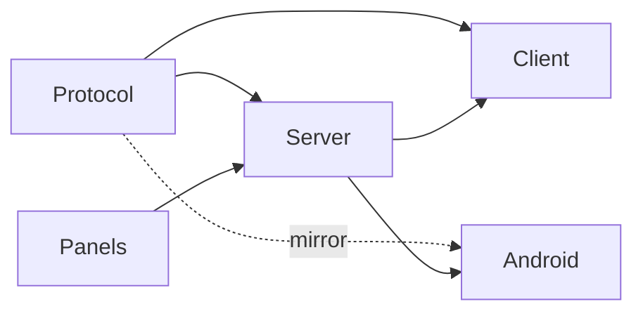
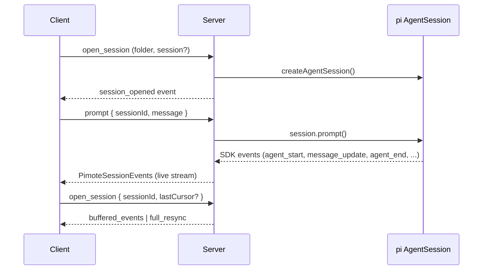
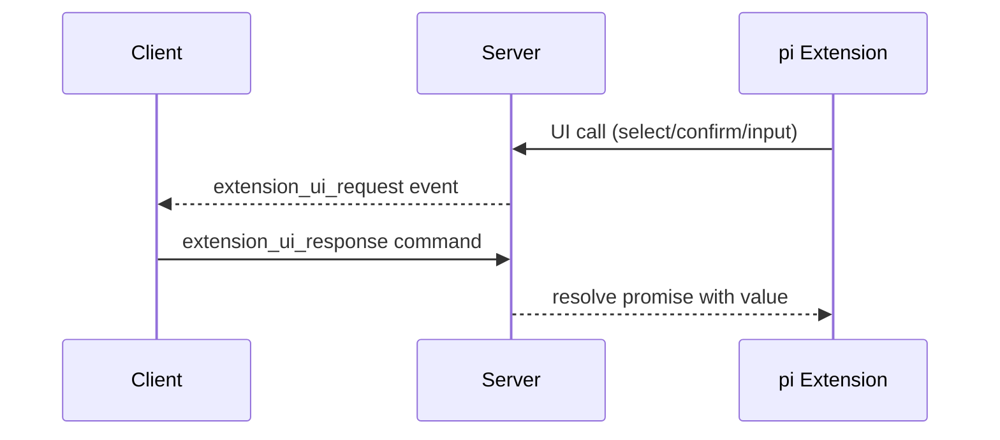

# Codemap

## Overview

Pimote is a PWA + Node.js server for remote access to pi (a coding agent). npm workspace with three published packages: a Node.js HTTP+WebSocket server managing pi AgentSession instances, a SvelteKit PWA client (Svelte 5 runes, shadcn-svelte) for real-time conversation rendering, and a standalone `@pimote/panels` library for extensions to push structured card data. The shared protocol types live in `shared/` as a tsc-only project (not a published package). A voice extension lives inside the server at `server/src/voice/` and is loaded into pi sessions only when voice is configured — it bridges a WebRTC call (via an externally managed speechmux service; pimote does not spawn it) into a running pi session. A static-host extension lives inside the server at `server/src/static-host/` and is loaded into every pi session — it lets the agent host static HTML/asset bundles at `/s/<slug>/` URLs surfaced as tappable panel cards. A separate native Kotlin Android client under `mobile/android/` (independent Gradle project, Docker-based build) is a voice-first peer to the PWA targeting sustained calls and Android Auto — both via `SelfManagedConnectionService` (system telephony / Assistant routing) and a templated `CarAppService` POI car-app surface (`car/`) for placing project/session calls from the head unit. Supports multiple concurrent sessions, session ownership/takeover, Web Push notifications, extension UI bridging, a real-time side panel displaying extension-provided cards, and browser-driven or Android-native voice calls into a pi session (interpreter + worker LLM split, walk-back surgery, speak() tool).



### Key Flows





```mermaid
sequenceDiagram
  participant C as Client
  participant S as Server
  participant O as VoiceOrchestrator
  participant M as speechmux
  participant V as Voice ext

  C->>S: call_bind { sessionId }
  S->>O: bindCall()
  Note over M: speechmux runs externally<br/>(systemd / container / remote)
  O-->>V: activate(call)
  V-->>C: call_ready (SDP/ICE via signaling)
  C<->>M: WebRTC audio (mic ↔ TTS)
  V-->>S: speak() / walk-back edits
  C->>S: call_end | displacement
  S->>O: endCall()
  O-->>V: deactivate
  S-->>C: call_ended
```

## Modules

### Protocol

Shared TypeScript types defining the WebSocket wire format between client and server.

**Responsibilities:** command types (client→server), event types (server→client), response envelope, session/message/folder data shapes, session metadata contracts (`SessionMeta` includes git branch, context-window usage, and per-session lifetime dollar cost via `lifetimeCostUsd`), push subscription types, extension UI request/response types (including `UI_BRIDGE_DISABLED_IN_VOICE_MODE` reason code for voice-mode gating), slash command types, `@`-file-path autocomplete command (`complete_file_refs` client→server `{type, sessionId, prefix}`, response reusing the generic `AutocompleteResponseItem`), tree navigation wire contracts (`PimoteTreeNode`, `navigate_tree`/`set_tree_label`, `tree_navigation_start`/`tree_navigation_end`), project management commands (`create_project`), panel/card data types (Card, BodySection, CardColor, BodySectionStyle, PanelUpdateEvent), voice-call wire contracts (`call_bind`/`call_end` commands; `call_bind_response`/`call_ready`/`call_ended`/`call_status` events; `VOICE_INTERRUPT_CUSTOM_TYPE` for walk-back/interrupt custom messages), interactive provider-login wire contracts (global, **not** session-scoped: `LoginProviderInfo`; the four `login_list`/`login_begin`/`login_input`/`login_cancel` commands + `LoginListResponseData`/`LoginBeginResponseData` (`{ ok, reason?: 'busy' }`) response shapes; the `LoginStep` discriminated union — `auth`/`device_code`/`prompt`/`select`/`progress`/`done` — and `LoginStepEvent`)

**Dependencies:** none

**Files:**

- `shared/src/protocol.ts` — full wire protocol contracts and discriminated unions (including `SessionMeta.lifetimeCostUsd`, tree navigation types/events; the `CompleteFileRefsCommand` (`complete_file_refs`) `@`-file-path autocomplete request — autocomplete-only, no server-side `@`-reference expansion — whose response reuses `AutocompleteResponseItem`; `Card` carries an optional `href` for tappable panel cards that link out to server-hosted URLs; the global provider-login `login_*` commands/responses + `LoginStep`/`LoginStepEvent`)
- `shared/src/index.ts` — protocol re-exports

### Server

Node.js HTTP + WebSocket server that hosts pi AgentSession instances and bridges them to remote clients.

**Responsibilities:** HTTP static serving + SPA fallback, static-host `/s/<slug>/*` route (between static-asset lookup and SPA fallback) backed by the in-server static-host extension, WebSocket upgrade + message routing, client identity registry, three-layer session model (ManagedSlot wrapping AgentSessionRuntime + ClientConnection + SessionState), runtime factory pattern for pi SDK session creation (with the voice extension factory threaded via `resourceLoaderOptions` only when voice is configured — otherwise sessions don't load it at all), session state lifecycle helpers (create/teardown/rebuild), session open/close/resume/idle-reap/takeover, event buffering with delta coalescing for reconnect replay, folder/session filesystem discovery, project folder creation (`mkdir` + `git init`), extension UI bridging (dialog→WebSocket round-trips, fire-and-forget→events, TUI-only→no-ops) with voice-mode gating via `isVoiceModeActive` predicate (dialog calls short-circuit to `UI_BRIDGE_DISABLED_IN_VOICE_MODE`), extension command context actions, SDK message mapping, session conflict detection (external pi processes via /proc + remote pimote sessions), config loading + VAPID key management + voice config (`voice` section with `speechmuxSignalUrl` + `speechmuxLlmWsUrl`, `defaultInterpreterModel`, `defaultWorkerModel`), Web Push notification delivery, session metadata enrichment (`get_session_meta`: git branch, context-window usage, per-session lifetime dollar cost summed over assistant branch entries), git branch detection, pimote slash-command handling (`/new`, `/reload`, `/tree`) plus autocomplete surfaces for extension/skill/template commands, `@`-file-path autocomplete (`complete_file_refs` dispatch → `completeFileRefs` over the session cwd, emulating pi's interactive TUI `@` behavior: autocomplete-only, literal `@path` text flows through prompt/steer/follow_up unchanged with NO server-side `<file>` inlining and NO attachments — the agent reads referenced files via its own `read` tool; one-time fd-missing `notify` warning per connection), tree navigation command lifecycle (`navigate_tree`, `set_tree_label`) with buffered lifecycle events + full-resync handoff, voice call lifecycle (`call_bind`/`call_end` routing into the orchestrator, displacement teardown of active voice calls, EventBus activate/deactivate emission into the voice extension) — fully no-op'd when voice is not configured, interactive provider-login lifecycle (global `login_list`/`login_begin`/`login_input`/`login_cancel` routing into the single server-wide `LoginOrchestrator`, per-connection pending-input map + abort controller, connection-bound transport binding, `/login` in the autocomplete command list), host of the in-server voice extension (`server/src/voice/`), host of the in-server static-host extension (`server/src/static-host/`) — boots its `InMemoryStaticHostRegistry` + `FileStaticHostStore` rooted at `PIMOTE_STATIC_HOST_DIR`, sweeps orphan store files via `gcStaticHostStore` before `server.start()`, and threads the extension factory into every pi session, client version mismatch detection, EventBus creation + panel channel wiring (detect/data listeners), per-session panel state tracking with throttled pushes, panel snapshot delivery on reconnect/session-switch, idle-reap protection while tree navigation is in progress

**Dependencies:** Protocol (wire format types)

**Files:**

- `server/src/index.ts` — entry point (boots the voice orchestrator via `voice-orchestrator-boot`; boots the static-host registry/store, runs `gcStaticHostStore` against the live session set, builds the static-host extension factory, threads it into `PimoteSessionManager`, and passes the registry to `createServer` for the `/s/*` route)
- `server/src/paths.ts` — XDG state paths including `PIMOTE_STATIC_HOST_DIR` (per-session `<sessionId>.json` registrations)
- `server/src/config.ts` — config loading, VAPID key auto-generation, optional `voice` section plus `defaultInterpreterModel` / `defaultWorkerModel`
- `server/src/server.ts` — HTTP server, static files, WebSocket upgrade, client registry, version checking; mounts `serveStaticHostRoute` for `/s/<slug>/*` between the static-asset lookup and the SPA fallback
- `server/src/file-references.ts` / `server/src/file-references.test.ts` — `fd`-backed `@`-file-path autocomplete: pure `completeFileRefs(input)` parses the `@`-token into a typed scope + fd query via deterministic last-slash scoping (supports `~/`, `/abs`, `./`, `../`, bare relative against the session cwd), invokes `fd --type f --type d --hidden --follow --exclude .git --max-results 50 --base-directory <baseDir>`, and maps results to `AutocompleteResponseItem[]` with `@`-prefixed inserted tokens (trailing `/` for dirs, quoting for spaces). Degrades to `{ items: [], fdAvailable: false }` when the `fd` binary is missing (spawn `ENOENT`). Pure aside from the injected/real `runFd` seam (`FdRunner`/`FdInvocation`/`FdRunResult`). No `<file>` inlining, no attachments
- `server/src/ws-handler.ts` — per-connection command handler, multi-session routing, session ownership/displacement (tears down any active voice call on displace), conflict detection, `/tree` prompt interception + session-tree mapping, `navigate_tree`/`set_tree_label` handlers with `tree_navigation_start`/`tree_navigation_end` event emission and full-resync orchestration, in-place session reset via slot.runtime (newSession/fork/switchSession with rebuildSessionState + reKey), `create_project` handler (name/root validation, `mkdir` + `git init`), `list_folders` response includes configured roots, `get_session_meta` computation (git branch, context usage, `lifetimeCostUsd` via `sumAssistantCostUsd(getBranch())`), `call_bind`/`call_end` command routing into the voice orchestrator, `isVoiceModeActive` predicate feeding the extension UI bridge so dialog UI requests return `UI_BRIDGE_DISABLED_IN_VOICE_MODE` while a call is bound, global `login_*` command routing into `getLoginOrchestrator()` (single-flight via `LoginBusyError` → `{ ok:false, reason:'busy' }`), per-connection `pendingLoginInputs` map + `loginAbort` controller, `createLoginTransport()` binding a connection-scoped `LoginTransport` (emits `login_step` events, resolves prompt/select inputs, `settlePendingLoginInputs` on flow end/cancel), `/login` registered in `get_commands` autocomplete, `complete_file_refs` dispatch (resolves session cwd via `slot.folderPath`, calls `completeFileRefs`, returns `{ items }`) with a one-time fd-missing `notify` warning via the fire-and-forget extension-UI bridge (per-connection `fdWarningEmitted` flag + `emitFdMissingWarning`)
- `server/src/session-cost.ts` / `server/src/session-cost.test.ts` — pure cost summation helper (`sumAssistantCostUsd`) and contract tests for assistant-only branch cost filtering
- `server/src/session-manager.ts` — ManagedSlot/ClientConnection/SessionState types, slot-based event + UI helpers (send, wait, resolve, replay), AgentSessionRuntime factory for session creation, owns the shared pi-SDK `AuthStorage` + `ModelRegistry` and constructs the single server-wide `LoginOrchestrator` over them (exposed via `getLoginOrchestrator()` — login is global, not session-scoped), session state lifecycle (createSessionState/teardownSessionState/rebuildSessionState), threads the in-server voice extension factory into pi sessions via `resourceLoaderOptions` only when voice is configured (URLs + interpreter/worker models present); otherwise sessions skip loading it entirely; threads the static-host extension factory into every pi session via the same `resourceLoaderOptions.extensionFactories` mechanism, `treeNavigationInProgress` state tracking, reKeySession for session replacement, idle reaping with tree-navigation skip protection, EventBus creation + panel listener wiring, throttled panel push scheduling
- `server/src/login-orchestrator.ts` / `server/src/login-orchestrator.test.ts` — `LoginOrchestrator`: server-wide singleton (constructed by `session-manager.ts`) over the shared `AuthStorage` + `ModelRegistry`, expressed against narrow structural seams (`LoginAuthStorage`/`LoginModelRegistry`/`LoginTransport`) so tests inject in-memory fakes. Lists OAuth providers with logged-in status, runs a single login flow at a time (synchronous busy guard before first await → `LoginBusyError`), translates pi's `OAuthLoginCallbacks` (onAuth/onDeviceCode/onPrompt/onManualCodeInput/onSelect/onProgress) into connection-bound `LoginTransport` step events, and on success calls `modelRegistry.refresh()`; emits its own terminal `done` step on success or failure
- `server/src/voice-orchestrator.ts` — VoiceOrchestrator: per-session call registry, `bindCall`/`endCall` dispatch, EventBus `voice:activate` / `voice:deactivate` emission into the session's voice extension; `stop()` clears active-call bookkeeping on shutdown
- `server/src/voice-orchestrator-boot.ts` — boot wiring: `isVoiceConfigured(config)` predicate plus `buildVoiceOrchestrator()` which returns `null` when voice config (`voice.speechmuxSignalUrl` + `voice.speechmuxLlmWsUrl`) is absent so callers skip all voice wiring; otherwise wires displacement and exposes `isOwnedByVoiceCall`. Speechmux is treated as externally managed — pimote no longer spawns a sidecar
- `server/src/voice-orchestrator.test.ts` — tests
- `server/src/event-buffer.ts` — ring buffer, SDK→wire event mapping (including buffered `tree_navigation_*` lifecycle events), streaming delta coalescing
- `server/src/message-mapper.ts` — SDK AgentMessage → PimoteAgentMessage conversion
- `server/src/extension-ui-bridge.ts` — extension UI calls → WebSocket events
- `server/src/panel-state.ts` — pure panel state helpers: applyPanelMessage (namespace→cards map), getMergedPanelCards (flatten + namespace-prefix IDs)
- `server/src/folder-index.ts` — filesystem scanning for project folders and sessions, exposes configured `roots` for project creation
- `server/src/takeover.ts` — /proc scanning for external pi processes, kill with SIGTERM/SIGKILL
- `server/src/push-notification.ts` — PushNotificationService, subscription CRUD, delivery
- `server/src/push-infrastructure.ts` — FilePushSubscriptionStore, WebPushSender
- `server/src/**/*.test.ts` — tests

### Client

SvelteKit PWA rendering pi conversations in real time with session/folder browsing, model/thinking controls, extension UI, and push notifications.

**Responsibilities:** WebSocket connection with auto-reconnect (backoff→connecting→syncing→ready), per-session cursor tracking, stable client identity (localStorage-persisted), multi-session state management (SessionRegistry with $state() runes), localStorage persistence of active sessions and viewed session for cross-restart restoration, streaming message accumulation with stable DOM keying, folder/session index browsing, streaming markdown rendering (smd + highlight.js), tool call visualization, model/thinking pickers, session-summary formatting helpers (display name, context-window usage, lifetime dollar cost), extension UI queue (inline select/confirm + modal input/editor with CodeMirror code editor), input bar with prompt/steer/follow-up/abort modes + slash command autocomplete + TUI-style `@`-file-path autocomplete (cursor-relative `@`-trigger, `fd`-backed suggestion menu, insert-on-accept replacing the `@`-token, drill into directories; literal `@path` text sent through unchanged) + `/tree` dialog handoff + client-side `/login` interception (opens the login dialog instead of prompting the agent), interactive provider-login flow (global `LoginDialog` overlay driven by a `LoginStore` flow state machine: provider picker → auth/device_code/prompt/select/progress/done steps rendered generically, with the auth URL latched separately so it survives the immediately-following manual-code paste prompt; success re-pulls available models for the viewed session), tree-navigation dialog lifecycle (search/filter/collapse, label editing, summarize modes, navigation lifecycle event handling, close-on-resync behavior), post-navigation editor text injection, pending steering message display with dequeue-to-edit recall, per-session draft persistence, fuzzy matching, service worker for push notifications, PWA install prompt, active session bar with status indicators, StatusBar rendering of session metadata (rename affordance, git branch, context, lifetime cost), text-to-speech playback via per-message TTS button, panel card display (desktop side panel + mobile overlay), project creation flow (root selection + name input + `create_project` command)

**Dependencies:** Protocol (wire format types), Server (WebSocket API)

**Files:**

- `client/src/lib/stores/persistence.ts` — localStorage helpers for client state (clientId, active sessions, viewedSessionId) with typed read/write functions, centralized key naming, and silent error handling
- `client/src/lib/stores/persistence.test.ts` — tests
- `client/src/lib/stores/connection.svelte.ts` — WebSocket lifecycle, reconnect phases, cursor tracking, push re-registration, clientId hydration from persistence
- `client/src/lib/stores/session-registry.svelte.ts` — SessionRegistry class, event routing, streaming message accumulation, `get_session_meta` hydration into per-session context usage + `lifetimeCostUsd`, session lifecycle helpers, active-session hydration and persistence on mutation, pending steering message reconciliation
- `client/src/lib/stores/session-registry.test.ts` — tests
- `client/src/lib/stores/index-store.svelte.ts` — folder/session index browsing state, stores configured roots from `list_folders` response for project creation
- `client/src/lib/stores/command-store.svelte.ts` — per-session command cache
- `client/src/lib/stores/command-store.test.ts` — tests
- `client/src/lib/stores/extension-ui-queue.svelte.ts` — extension UI request queue, inline vs modal routing
- `client/src/lib/stores/input-bar.svelte.ts` — shared editorText request bus (`setEditorText`) used by extension bridge and tree-navigation responses; shared image handoff from Web Share Target
- `client/src/lib/stores/tree-dialog.svelte.ts` — TreeDialogStore state/lifecycle (open/close, selection, fold state, loading, filter/search), filtered tree derivation, local label mutation
- `client/src/lib/stores/tree-dialog.svelte.test.ts` — tests
- `client/src/lib/stores/speech.svelte.ts` — singleton speech playback state (speak/stop/toggleTts/playingKey)
- `client/src/lib/stores/voice-call.svelte.ts` — `VoiceCallStore` class: reactive voice-call state machine (idle/binding/ready/active/ending/error), seam-based so WebRTC/signaling/getUserMedia can be injected in tests; tracks `startedAt` (set on first `connected`, cleared on `idle`) and exposes `abortAgent()` for the calling-mode swipe-down gesture
- `client/src/lib/stores/voice-call.svelte.test.ts` — tests
- `client/src/lib/stores/voice-call-seams.ts` — browser implementation of the voice-call seams: `getUserMedia`, `RTCPeerConnection` setup, SDP/ICE signaling bridge over the pimote WebSocket, and an analyser-backed `getRemoteAudioLevel` (10Hz RMS sampling of the inbound peer track) for the calling-mode pulse
- `client/src/lib/stores/voice-call-store.ts` — singleton wiring: constructs the `VoiceCallStore` with browser seams, routes server voice events (`call_bind_response`/`call_ready`/`call_ended`/`call_status`) into the store, synthesizes a `call_ended` on session displacement
- `client/src/lib/stores/login.svelte.ts` / `client/src/lib/stores/login.svelte.test.ts` — `LoginStore` class: client-side provider-login flow state machine (`idle`/`listing`/`picking`/`running`/`done`), provider list + current `LoginStep`, latched `authInfo` so the auth-URL link survives the manual-code prompt, constructor-injected seams (`sendCommand`/`getViewedSessionId`) so tests substitute an in-memory command bus; `open()`/`begin()`/`submitInput()`/`cancel()`/`handleStep()`, re-pulls `get_available_models` on successful `done`
- `client/src/lib/stores/login-store.ts` — singleton wiring: constructs the `LoginStore` over the real pimote WS connection + session registry and routes incoming `login_step` events into it (mirrors `voice-call-store.ts`)
- `client/src/lib/stores/panel-store.svelte.ts` — PanelStore class: reactive card list for viewed session, handlePanelUpdate/reset methods
- `client/src/lib/stores/panel-store.svelte.test.ts` — tests
- `client/src/lib/stores/speech.svelte.test.ts` — tests
- `client/src/lib/components/Panel.svelte` — side panel rendering card list with color-coded borders, header/body/footer sections; renders the card root as a plain `<a href>` when `card.href` is set so taps deep-link to server-hosted routes like `/s/<slug>/` (resolved as a server URL, not a SvelteKit `resolve()` route)
- `client/src/lib/components/MessageList.svelte` — scrollable message list with unified display entries and auto-scroll; `readOnly` prop suppresses input affordances and pointer events for the calling-mode transcript
- `client/src/lib/components/Message.svelte` — message rendering (user, assistant, custom, system) with per-message TTS toggle
- `client/src/lib/components/TtsButton.svelte` — per-message text-to-speech play/stop button
- `client/src/lib/components/TextBlock.svelte` — streaming markdown rendering via smd
- `client/src/lib/components/ThinkingBlock.svelte` — collapsible thinking block
- `client/src/lib/components/ToolCall.svelte` — tool call display with streaming args/results; `edit` tool calls render as per-edit fenced ```diff blocks via `TextBlock`(built from`edit-diff.ts`helpers) and auto-expand while streaming / auto-collapse on completion (ThinkingBlock pattern); a parallel`write`branch renders the file body via`WriteFileBlock`
- `client/src/lib/components/WriteFileBlock.svelte` — `write`-tool file-body visualization: renders in code mode (highlighted `<pre><code>` via `code-highlight.ts`) or markdown mode (via `TextBlock`) based on `inferLanguageFromPath(path)`, with collapse + copy-raw-source chrome and auto-expand-while-streaming / auto-collapse-on-completion behavior in both modes
- `client/src/lib/edit-diff.ts` — `edit`-tool visualization helpers: pure `buildEditDiffMarkdown(args)` that converts finalized edit args to fenced ```diff markdown, and `createEditDiffStreamer()`that consumes raw JSON deltas via`@streamparser/json`and exposes a progressively-rebuilt`markdown` string byte-identical to the finalized output
- `client/src/lib/edit-diff.test.ts` — tests
- `client/src/lib/write-content.ts` — `write`-tool content extraction (mirrors `edit-diff.ts`): pure `extractWriteContent(args)` for finalized args plus `createWriteContentStreamer()` that reads `$.content` via `@streamparser/json` with byte-identical streaming→finalized handoff
- `client/src/lib/write-content.test.ts` — tests
- `client/src/lib/code-highlight.ts` — shared streaming-highlight engine built on the `syntax-highlighter.ts` hljs instance: pure `highlightToHtml(text, language)` plus stateful `IncrementalHighlighter` (schedule/flush/dispose) via `createIncrementalHighlighter({intervalMs})` with a ~100ms trailing-edge throttle + forced flush
- `client/src/lib/code-highlight.test.ts` — tests
- `client/src/lib/components/StreamingCollapsible.svelte` — reusable collapsible pre block with show-more/less
- `client/src/lib/components/StreamingIndicator.svelte` — animated working dots
- `client/src/lib/components/InputBar.svelte` — prompt input with slash command integration, `@`-trigger detection (runs before the slash gate, cursor-relative, mutually exclusive with `/` per token) feeding the `fileRefs` autocomplete mode with an insert-on-accept path that replaces the `@`-token (keeps the menu open to drill into directories), `/tree` response detection, optimistic-user-message skip for tree prompts, tree dialog opening, bare `/login` interception (opens the `LoginDialog` via `loginStore.open()` instead of sending a prompt)
- `client/src/lib/components/LoginDialog.svelte` — global provider-login overlay: renders the picker and each `LoginStep` generically (picking/auth/device_code/prompt/select/progress/done), shows the latched auth-URL link alongside the paste field, drives `loginStore` (begin/submitInput/cancel)
- `client/src/lib/file-ref-prefix.ts` / `client/src/lib/file-ref-prefix.test.ts` — pure `@`-file-ref helpers: `extractFileRefPrefix(textBeforeCursor)` extracts the `@`-token immediately before the cursor (token-boundary detection, quoted `@"…"` tokens, trailing-space termination; returns `null` when no trigger), and `resolveFileRefSelection(value)` decides how an accepted item is applied (terminal file vs directory drill-in that re-arms the still-open token)
- `client/src/lib/components/CommandAutocomplete.svelte` — slash command autocomplete popup with a third `fileRefs` mode alongside `command`/`args`, reusing the generic debounced-fetch / stale-discard / render machinery; in `fileRefs` mode sends `complete_file_refs` with the full `@`-token as prefix
- `client/src/lib/components/InlineSelect.svelte` — inline extension UI (select with 1-9/arrows, confirm with Y/N)
- `client/src/lib/components/ExtensionCodeEditor.svelte` — CodeMirror-based code editor for extension UI editor dialogs with language detection and dark theme
- `client/src/lib/components/ExtensionDialog.svelte` — modal extension UI (input, editor with CodeMirror)
- `client/src/lib/components/TreeDialog.svelte` — tree navigation modal (recursive tree rendering, search/filter, summarization modes, label editor popover, `navigate_tree`/`set_tree_label` commands, lifecycle event handling)
- `client/src/lib/components/ExtensionStatus.svelte` — extension status display
- `client/src/lib/components/StatusBar.svelte` — session status header; renders context usage and the formatted lifetime cost figure alongside git branch / connection status, hosts `CallButton`
- `client/src/lib/components/CallButton.svelte` — voice-call toggle button (`inline` variant for `StatusBar`, `dialog-row` variant labelled Start/End for `SessionSettingsDialog`)
- `client/src/lib/components/CallingMode.svelte` — full-screen in-call surface rendered conditionally by `+page.svelte`; composes `CallHeader`, a read-only `MessageList`, and `CallGestureZone`
- `client/src/lib/components/CallHeader.svelte` — top region of calling mode: project/session label, MM:SS duration ticker, mic state, hosts `CallStateRow`
- `client/src/lib/components/CallStateRow.svelte` — agent-state pulse + label (listening/thinking/speaking); the speaking treatment scales with `remoteAudioLevel`
- `client/src/lib/components/CallGestureZone.svelte` — bottom region of calling mode; pointer recogniser + audio cues (tap=mute, swipe-up=hang up, swipe-down=abort)
- `client/src/lib/components/call-state.ts` / `call-state.test.ts` — pure helpers: `AgentState`, `deriveAgentState`, `formatCallDuration`
- `client/src/lib/components/call-gesture.ts` / `call-gesture.test.ts` — `recognizeCallGesture` pointer-sample gesture recogniser
- `client/src/lib/call-audio-cues.ts` / `call-audio-cues.test.ts` — `createCallAudioCues` factory: lazy `AudioContext`, mute-on/mute-off/abort-confirm beeps via `OscillatorNode`s
- `client/src/lib/components/ActiveSessionBar.svelte` — session tab bar with status dots
- `client/src/lib/components/FolderList.svelte` — folder browser, new-session picker dialog with 'Create new project' multi-step flow (root selection → name input → `create_project`)
- `client/src/lib/components/SessionItem.svelte` — session list item
- `client/src/lib/components/ModelPicker.svelte` — model selection dropdown
- `client/src/lib/components/ThinkingPicker.svelte` — thinking level dropdown
- `client/src/lib/components/NotificationBanner.svelte` — push notification opt-in prompt
- `client/src/lib/components/InstallBanner.svelte` — PWA install prompt
- `client/src/lib/components/PendingSteeringMessages.svelte` — pending steering message display
- `client/src/lib/components/ui/**` — shadcn-svelte primitives (button, badge, dialog, dropdown-menu, input, scroll-area, separator)
- `client/src/lib/markdown-to-speech.ts` — pure function converting markdown to speakable plain text
- `client/src/lib/markdown-to-speech.test.ts` — tests
- `client/src/lib/smd-renderer.ts` — streaming-markdown renderer with highlight.js and URL scheme allowlisting; fenced code highlights WHILE streaming (throttled `add_text` schedule) and on `end_token` (forced flush) via one `IncrementalHighlighter` per renderer
- `client/src/lib/smd-renderer.test.ts`, `client/src/lib/smd-underscore-fix.test.ts` — tests
- `client/src/lib/syntax-highlighter.ts` — highlight.js language registration (lazy-loaded subset)
- `client/src/lib/codemirror-language.ts` — CodeMirror language extension loader
- `client/src/lib/codemirror-theme.ts` — CodeMirror dark editor theme
- `client/src/lib/editor-language.ts` — language detection for extension editor dialogs (from title/content heuristics); also pure `inferLanguageFromPath(path)` mapping a file extension to `EditorLanguage` via the existing `EXTENSION_LANGUAGE_MAP`
- `client/src/lib/editor-language.test.ts` — tests
- `client/src/lib/extension-dialog-state.ts` — extension dialog initial value logic (input vs editor prefill)
- `client/src/lib/extension-dialog-state.test.ts` — tests
- `client/src/lib/widget-cards.ts` — converts extension widget string-lines to panel Card objects
- `client/src/lib/widget-cards.test.ts` — tests
- `client/src/lib/session-summary.ts` / `client/src/lib/session-summary.test.ts` — pure session-summary helpers (`getSessionDisplayName`, context formatting, `formatSessionCost`) and formatting contract tests
- `client/src/lib/format-relative-time.ts` — relative time formatting (e.g. "5m ago")
- `client/src/lib/fuzzy.ts` — fuzzy matching utility
- `client/src/lib/fuzzy.test.ts` — tests
- `client/src/lib/utils.ts`, `client/src/lib/index.ts` — utilities
- `client/src/lib/highlight-theme.css` — syntax highlight theme
- `client/src/sw.ts` — service worker (push notifications, notification click handling)
- `client/src/routes/+page.svelte` — main page (session view or landing); conditionally renders `CallingMode` over the chat surface when the active session is in a voice call
- `client/src/routes/+layout.svelte` — app shell, connection init, service worker registration, desktop panel integration (flex sibling), mobile panel overlay, global overlay mounting (`TreeDialog`, `ExtensionDialog`, `LoginDialog`); side-effect import of `login-store.js` to subscribe the login store to `login_step` events at boot
- `client/src/routes/+layout.ts`, `client/src/routes/layout.css` — layout config and styles
- `client/src/app.html`, `client/src/app.d.ts` — SvelteKit app shell
- `client/src/test/mocks/app-environment.ts` — test mock
- `client/static/**` — Static assets (PWA manifest & icons, robots.txt)
- `client/svelte.config.js`, `client/vite.config.ts`, `client/vitest.config.ts` — build config

### Tools

Standalone diagnostic and debugging scripts for stream/API analysis.

**Responsibilities:** APIM SSE diagnostics, stream timing measurement, comparative stream analysis, voice-mode mock-speechmux smoke test

**Dependencies:** none (voice smoke script talks to the server via the protocol types only)

**Files:**

- `tools/apim-diagnose.ts` — APIM SSE diagnostic tool
- `tools/stream-compare.ts` — comparative stream timing (proxy vs direct)
- `tools/stream-timing.ts` — stream timing tool
- `tools/stream-timing-fetch.ts` — raw fetch stream timing (Accept-Encoding effects)
- `tools/stream-timing-raw.ts` — raw Anthropic stream timing
- `scripts/voice-mock-smoke.mjs` — mock-speechmux smoke script: drives `call_bind`/`call_end`, asserts UI-bridge gating (`UI_BRIDGE_DISABLED_IN_VOICE_MODE`), exercises the voice extension-runtime reducers and the displacement teardown path

### Panels

Workspace package (`@pimote/panels`) for extensions to push structured card data into the pimote side panel via pi's EventBus.

**Responsibilities:** card/panel data types (Card, BodySection, CardColor, BodySectionStyle, PanelHandle, PanelMessage), pimote runtime detection via synchronous EventBus round-trip, scoped panel handles with namespace isolation and handle deactivation on re-detect

**Dependencies:** pi SDK (`ExtensionAPI` type only)

**Files:**

- `packages/panels/src/index.ts` — re-exports types and detect function
- `packages/panels/src/types.ts` — Card, BodySection, CardColor, BodySectionStyle, PanelHandle, PanelMessage type definitions (`Card.href` carries the optional tappable URL)
- `packages/panels/src/detect.ts` — detect() function: synchronous EventBus probe, handle creation with namespace scoping, previous-handle deactivation
- `packages/panels/src/detect.test.ts` — tests

### Voice Extension

In-server pi extension (`server/src/voice/`) — loaded into pi sessions only when voice is configured. Hosts the voice-mode client inside the agent process and bridges a WebRTC call (via an externally managed speechmux service) into a running pi session. Not a published npm package — it's compiled as part of `@pimote/server` and threaded into sessions by `session-manager.ts` via `resourceLoaderOptions.extensionFactories`.

**Responsibilities:** activation state machine (dormant ↔ active, driven by `pimote:voice:activate` / `pimote:voice:deactivate` EventBus signals from the server orchestrator), speechmux WebSocket client (per-call connect, signaling relay, interrupt/barge-in handling), FSM reducers (tool-call / message-event handling for the interpreter+worker split), walk-back surgery (rewriting the in-flight pi message history when the user interrupts or the interpreter course-corrects), `speak()` tool exposed to the worker LLM, `INTERPRETER_PROMPT` system prompt, emission of `VOICE_INTERRUPT_CUSTOM_TYPE` messages, `wait-for-idle` helper used by the FSM during turn handoff

**Dependencies:** pi SDK (`ExtensionAPI`, custom message / tool APIs), Protocol (voice wire types consumed via EventBus payloads), Server (lives inside it)

**Files:**

- `server/src/voice/index.ts` — extension factory: registers tools (`speak`), subscribes to EventBus voice signals, owns the state machine instance
- `server/src/voice/state-machine.ts` — pure activation state machine (states + transitions) shared by the extension and tests
- `server/src/voice/walk-back.ts` — message-history surgery: trim/rewrite the in-flight conversation on interrupt / re-steer
- `server/src/voice/speechmux-client.ts` — WebSocket client to the externally managed speechmux service (signaling relay, interrupt plumbing)
- `server/src/voice/interpreter-prompt.ts` — `INTERPRETER_PROMPT` constant + composition helpers
- `server/src/voice/wait-for-idle.ts`, `server/src/voice/wait-for-idle.test.ts` — turn-idle helper used by the FSM + tests
- `server/src/voice/fsm/**` — FSM state, events, actions, text extraction, and per-state reducers driving the interpreter/worker split

### Static Host Extension

In-server pi extension (`server/src/static-host/`) — loaded into every pi session. Lets the agent host static HTML/asset bundles from a local folder at `/s/<slug>/` URLs that surface as tappable panel cards in the client. Not a published npm package — it's compiled as part of `@pimote/server` and threaded into sessions by `session-manager.ts` via `resourceLoaderOptions.extensionFactories`.

**Responsibilities:** two pi tools (`pimote_static_host` register + `pimote_static_host_remove`), slug validation + collision resolution, folder existence + `index.html` precondition checks, in-memory `StaticHostRegistry` (slug → folder + session + card metadata), per-session JSON persistence under `PIMOTE_STATIC_HOST_DIR` via `FileStaticHostStore` (atomic rename writes), boot-time GC of orphan `<sessionId>.json` files for evicted sessions, replay of persisted registrations on session rehydrate, panel-card emission for each registration (with `href: /s/<slug>/`) via `@pimote/panels`, HTTP route handler `/s/<slug>/*` with MIME-type mapping + directory traversal protection + `index.html` fallback, model-facing tool description text covering use cases, the mandatory responsive-layout rule, and the no-secrets rule

**Dependencies:** pi SDK (`ExtensionAPI`, `ExtensionFactory`, tool registration), Protocol (`Card`, `CardColor` via shared types), Panels (card emission), Server (lives inside it; HTTP route mounted by `server.ts`, bootstrap wired by `index.ts`)

**Files:**

- `server/src/static-host/index.ts` — extension factory (`createStaticHostExtension`): registers the two tools, owns per-session panel emission, captures `registry` + `store` by closure, resolves `sessionId` lazily via `ctx.sessionManager.getSessionId()`
- `server/src/static-host/registry.ts` — `StaticHostRegistry` interface + `InMemoryStaticHostRegistry`; `StaticHostRegistration` / `StaticHostCardMetadata` types
- `server/src/static-host/store.ts` — `StaticHostStore` interface + `FileStaticHostStore` (per-session `<sessionId>.json` under `PIMOTE_STATIC_HOST_DIR`, atomic writes via tmp+rename)
- `server/src/static-host/gc.ts` — `gcStaticHostStore(storeDir, validSessionIds)` boot-time sweep of orphan store files
- `server/src/static-host/http-handler.ts` — `serveStaticHostRoute(req, res, registry)` HTTP handler for `/s/<slug>/*` with MIME map, traversal protection, `index.html` fallback
- `server/src/static-host/tools.ts` — pure `executeRegisterTool` / `executeRemoveTool` functions (slug validation, folder/`index.html` checks, registry + store coordination); `RegisterToolInput` / `RemoveToolInput` types
- `server/src/static-host/prompt.ts` — `STATIC_HOST_TOOL_DESCRIPTION` model-facing tool description (use cases, mandatory responsive-layout rule, no-secrets rule)
- `server/src/static-host/*.test.ts` — unit tests for registry, store, gc, http-handler, tools, and the factory wiring

### Android Client

Native Kotlin Android app (`mobile/android/`) — voice-first, outgoing-only client complementary to the PWA. Same wire protocol; targets sustained voice calls (mic survives screen lock), Android Auto integration via the system telephony stack, and a templated `CarAppService` POI car-app surface (`car/`) that lets the driver place project/session calls directly from the head unit.

**Responsibilities:** persistent WS control connection to a configured pimote origin (auto-reconnect with exponential backoff + network-aware resume), hand-written Kotlin DTOs mirroring the voice-call subset of `shared/src/protocol.ts`, mirroring of the live project list (projects only — sessions excluded) into the Android system contacts database (`ContactsContract`) under a Pimote `AccountManager` Account — display names derived as `<root> <project>` (e.g. `repos pimote`) via `PhoneAccountRules.rootSegmentOf` so spoken queries like "call repos pimote" resolve, with a fallback to the bare project basename when there's no parent segment; debounced 2 s combine-and-diff, `CALLER_IS_SYNCADAPTER=true` batch writes (`READ_CONTACTS` / `WRITE_CONTACTS` runtime permissions are also requested at startup so Google Assistant / Gemini can resolve our contacts when the user speaks a name); one self-managed Pimote `PhoneAccount` registered with `setSupportedUriSchemes(["pimote"])` so Telecom routes calls on `pimote:session:<id>` / `pimote:project:<base64>` URIs back to us; **App Actions / dynamic-shortcut surface** (`shortcuts/`) that mirrors the live project list into `ShortcutManagerCompat` dynamic shortcuts — bound to an `actions.intent.CREATE_CALL` capability via `res/xml/shortcuts.xml` so Google Assistant / Gemini voice queries ("Hey Google, call repos pimote on Pimote") trampoline through `CallByNameActivity`, which resolves the spoken `participantName` (empty/fallback synonyms → most-recently-active project; exact match against shortcut `capabilityParameter` + synonyms; else fuzzy-match) before placing a `pimote:` call; outgoing-call orchestration (`open_session` for project hotline calls → `call_bind` with single-retry on owned-displacement → WebRTC peer to speechmux → `call_ready` → Telecom `Active`), in-call UI (Compose: setup screen, contacts screen, in-call screen launched explicitly on call activation), persistent app config via DataStore, an ongoing-call **foreground service** (`CallForegroundService`, type `phoneCall`) that posts a `NotificationCompat.CallStyle.forOngoingCall` notification with a hang-up action + tap-to-reopen while a call is non-idle (started by `AppContainer` on the Idle→non-Idle edge, self-stops on Ended/Idle), and **proximity-to-ear screen blanking** (`ProximityScreenLock` over `PROXIMITY_SCREEN_OFF_WAKE_LOCK`, held while `Active` on the earpiece per the pure `shouldHoldProximityLock` policy — released on speaker/BT/headset); and a **templated Android Auto car-app surface** (`car/`) — a `CarAppService` registered under the `androidx.car.app.category.POI` category with two `ListTemplate` screens: `ProjectListScreen` (root; one tappable row per project, tap places the project hotline new-session call, header `Sessions` action pushes the resume screen) and `ResumeSessionsScreen` (flat recency-sorted list of all sessions, tap resumes that session). Both screens are thin shells that collect the `SessionRepository` flows on their own lifecycle scope, re-derive rows through the pure `CarRowModels` seam, and dispatch taps through the same `CallByPimoteUri.placeCall` → Telecom/`PimoteConnectionService`/`CallController` path the in-app contacts UI uses; the car surface was NOT verified on-device (no DHU/host/device was available). Auth handled at the network layer outside the app — no in-app OIDC. The `SelfManagedConnectionService` connection also keeps the process alive while a call is bound. iOS / CarPlay out of scope. See DR-019 for why per-session/project PhoneAccounts (DR-018) was abandoned in favor of ContactsContract sync.

**Caveat (contact-card surface):** `CallByDataRowActivity` is wired as an `ACTION_VIEW` handler for the custom callable MIME (`vnd.com.pimote.android.call`) and works when invoked manually, but on Pixel 8 / Android 16 with stock Google Contacts the per-MIME action button does **not** render on the contact card despite end-to-end-correct wiring. Treat the contact-card surface as currently non-functional in user terms — the dialer name search and Assistant voice surfaces are what actually work today; a follow-up bug captures this.

**Dependencies:** Protocol (consumed as a reference document — Kotlin DTOs hand-mirror the voice-call subset; reciprocal `KEEP IN SYNC` header comments on `shared/src/protocol.ts` and `mobile/android/.../protocol/Protocol.kt`). Standalone Gradle project; not part of the npm workspace.

**Files:**

- `mobile/android/build.gradle.kts`, `mobile/android/settings.gradle.kts`, `mobile/android/gradle.properties`, `mobile/android/gradle/**`, `mobile/android/gradlew`/`gradlew.bat`, `mobile/android/build.Dockerfile` — Gradle skeleton + the `pimote-android-builder:local` Docker image used by `make android-test` / `make android-build`
- `mobile/android/app/build.gradle.kts`, `mobile/android/app/src/main/AndroidManifest.xml` — app module build (adds `androidx.car.app:app:1.7.0` + `androidx.car.app:app-projected:1.7.0` for the templated car surface) + manifest (registers `.car.PimoteCarAppService` with the `androidx.car.app.category.POI` intent-filter + `androidx.car.app.minCarApiLevel` meta-data, and an app-level `com.google.android.gms.car.application` meta-data pointing at `@xml/automotive_app_desc`; registers `PimoteConnectionService`, `PimoteAuthenticatorService` with `CONTACTS_STRUCTURE` meta-data, `PimoteSyncAdapterService`, `MainActivity` (with `android.app.shortcuts` meta-data pointing at `res/xml/shortcuts.xml`), `InCallActivity`, and the two App Actions / contact-card trampolines `CallByNameActivity` and `CallByDataRowActivity` — the latter with an `<intent-filter>` for `ACTION_VIEW` on the custom callable MIME; declares `INTERNET` / `RECORD_AUDIO` / `MANAGE_OWN_CALLS` / `READ_CONTACTS` / `WRITE_CONTACTS` permissions — the contacts permissions are runtime-prompted from `MainActivity` so voice assistants can read our entries; sync writes still go through `CALLER_IS_SYNCADAPTER` + own-Account)
- `mobile/android/app/src/main/res/xml/account_authenticator.xml`, `mobile/android/app/src/main/res/xml/contacts.xml`, `mobile/android/app/src/main/res/xml/syncadapter.xml`, `mobile/android/app/src/main/res/xml/shortcuts.xml` (declares the `actions.intent.CREATE_CALL` capability binding to `CallByNameActivity`), `mobile/android/app/src/main/res/xml/automotive_app_desc.xml` (`<automotiveApp><uses name="template"/>` declaration for the car-app host), `mobile/android/app/src/main/res/values/strings.xml`, `mobile/android/app/src/main/res/values/ic_launcher_background.xml`, `mobile/android/app/src/main/res/mipmap-anydpi-v26/{ic_launcher,ic_launcher_round}.xml`, `mobile/android/app/src/main/res/mipmap-{m,h,xh,xxh,xxxh}dpi/ic_launcher_foreground.png` — AccountManager account-type metadata (uses `@drawable/ic_call_outlined` so the Pimote account renders with the call glyph in the system contacts UI), ContactsContract callable-MIME schema (`vnd.com.pimote.android.call`), SyncAdapter shim metadata, and the adaptive launcher icon (foreground PNGs per density + per-v26 wrappers + background color)
- `mobile/android/app/src/main/kotlin/com/pimote/android/app/` — `PimoteApp` (Application; owns the process-wide `AppContainer` as a `lateinit val` and exposes a `Context.pimoteContainer` extension that every framework-instantiated caller — Activities, Services, ConnectionService, Compose ViewModel factories — goes through; starts `ContactSyncRunner` and `ShortcutsRunner` alongside the WS client), `AppContainer` (manual DI graph; constructs `Settings`, `WsClient`, `SessionRepository`, `PhoneAccountRegistrar`, `ContactSyncRunner`, `ShortcutsRunner` (with `AndroidShortcutManagerFacade`), `CallController`, `peerFactory`, `ProximityScreenLock` and observes `CallController.state` via the pure `Flow.onEdge` helper to launch `InCallActivity`, start `CallForegroundService`, and drive the proximity lock; no companion-object singleton — the dependency graph is visible at every call site), `MainActivity` (setup vs contacts root; constructs Compose ViewModels through their `Factory(container)` companions; also runtime-prompts `READ_CONTACTS` / `WRITE_CONTACTS` / `POST_NOTIFICATIONS` on first launch)
- `mobile/android/app/src/main/kotlin/com/pimote/android/accounts/` — `PimoteAccountAuthenticator` (stub `AbstractAccountAuthenticator`, no credentials — the Account exists solely to own contact rows in `ContactsContract`) + `PimoteAuthenticatorService` (binds for system AccountManager)
- `mobile/android/app/src/main/kotlin/com/pimote/android/contacts/` — `ContactsSync` (pure-function desired-set derivation + diff — projects-only, sessions are intentionally excluded from system contacts; display name is `<root> <project>` derived via `PhoneAccountRules.rootSegmentOf(folderPath)` with a fallback to the bare project basename when no root segment exists; uses `PhoneAccountRules.sanitize` for the source-id), `PimoteContactsContract` (custom callable MIME constant + pure `callableRowFor` mapping for the `vnd.com.pimote.android.call` data row), `ContactSyncRunner` (observes `SessionRepository`, ensures the Pimote AccountManager Account exists with a `ContactsContract.Settings` row marking `UNGROUPED_VISIBLE=1`, applies diff to `ContactsContract` via batched `ContentProviderOperation` writing the custom MIME row instead of `Phone.NUMBER` so Google Assistant / Gemini and the system contact card recognize the entries as callable), and `PimoteSyncAdapter` + `PimoteSyncAdapterService` (no-op `AbstractThreadedSyncAdapter` shim that exists purely to register the Pimote account as a first-class contacts source for visibility)
- `mobile/android/app/src/main/kotlin/com/pimote/android/protocol/Protocol.kt` — hand-written DTOs and `JsonContentPolymorphic` event dispatcher mirroring `shared/src/protocol.ts` voice/session subset
- `mobile/android/app/src/main/kotlin/com/pimote/android/net/` — `WsClient` interface + `WsClientImpl` orchestration (per-`connect()` lifetime state — origin, child `CoroutineScope`, active socket — collapsed into a single immutable `Session` record held in `MutableStateFlow<Session?>`; cancelling the scope tears down the loop and any nested coroutines together, so the old `disconnected: Boolean` / multiple `Job?` / `@Volatile` fields are gone; backoff attempt + wake-on-network-availability live as locals inside the connection loop), `WsTransport` / `NetworkAvailabilityMonitor` test seams, `Backoff.computeReconnectDelayMs`, `OkHttpWsTransport`, `AndroidNetworkAvailabilityMonitor`
- `mobile/android/app/src/main/kotlin/com/pimote/android/settings/` — `Settings` interface + `SettingsImpl` (DataStore-backed, single `Config(pimoteOrigin)` value)
- `mobile/android/app/src/main/kotlin/com/pimote/android/session/SessionRepository.kt` — `SessionRepository` + `SessionRepositoryImpl` (bootstrap via `list_folders` then concurrent `list_sessions` per folder, live-event reduction, refetch-on-unarchive, re-bootstrap on WS reconnect; collectors share one child `CoroutineScope` held in a `MutableStateFlow<CoroutineScope?>` slot so `start()`/`stop()` install/cancel a fresh scope rather than juggling multiple nullable `Job?` fields; the non-Connected→Connected refresh edge is detected via `runningFold` over `(prev, cur)` pairs, not a `var prev` capture) and the pure `reduceSessionEvent` reducer; `SessionMeta` carries `modified` / `created` / `messageCount` / `firstMessage` / `cwd` to drive grouped contact rows, and `reduceSessionEvent` takes an injected `now: () -> String` clock for deterministic timestamping in tests
- `mobile/android/app/src/main/kotlin/com/pimote/android/session/SessionListGroups.kt` — pure helper: `SessionProjectGroup` data class + `buildSessionProjectGroups` that combines folders and `SessionMeta` into the project-grouped, recency-sorted structure consumed by the contacts screen
- `mobile/android/app/src/main/kotlin/com/pimote/android/session/SessionDisplay.kt` — pure presentation helpers shared by the contacts UI: `sessionDisplayName` (firstMessage truncation / fallback), `shortenCwd`, `cwdLabelFor`, `formatRelativeTime`
- `mobile/android/app/src/main/kotlin/com/pimote/android/telephony/` — `PhoneAccountRegistrar` + `PhoneAccountRegistrarImpl` (registers a single Pimote service `PhoneAccount` with `setSupportedUriSchemes(["pimote"])`; ~30 lines), `PhoneAccountRules` (sanitization, folder-label disambiguation, source-id encoding, dial-URI parsing, plus pure helper `rootSegmentOf(folderPath)` consumed by `ContactsSync`/`ShortcutsSync` for `<root> <project>` display names; `disambiguateFolderLabels` is retained — still used by the in-app `ContactsScreen` — but no longer called from `ContactsSync`), `TelecomFacade` test seam + `AndroidTelecomFacade`, `CallConnection` test seam (interface: `reportRinging` / `reportActive` / `disconnectWithError(reason)` / `disconnectAsRemoteEnded(reason)` / `disconnectAsLocalHangup` / `setAudioRoute` — names declare the actual side effect; the disconnect-family methods all destroy the Telecom Connection with the appropriate `DisconnectCause`), `PimoteConnectionService` (self-managed; outgoing-only; parses dial URI directly from `request.address` via `PhoneAccountRules.parseDialUri`) + `PimoteConnection` (Telecom `Connection` subclass; `onDisconnect` just calls `callController.endCurrentCall()` — the eventual `setDisconnected + destroy` runs through `disconnectAsLocalHangup()` inside `CallController.terminate`, after the peer is released, so the audio mode doesn't flip back to NORMAL while AudioRecord is still open)
- `mobile/android/app/src/main/kotlin/com/pimote/android/voice/SpeechmuxPeerImpl.kt` — `SpeechmuxPeer` over `io.getstream:stream-webrtc-android` (signaling WS, ICE candidate buffering until `session` envelope, `AudioRecord` mic, `IceConnectionState.CONNECTED` gate)
- `mobile/android/app/src/main/kotlin/com/pimote/android/util/FlowEdge.kt` — pure `Flow<T>.withPrevious()` and `Flow<T>.onEdge(predicate)` helpers used by `AppContainer.init` and `SessionRepository` to react to transitions without `var prev` captures across coroutine resumptions
- `mobile/android/app/src/main/kotlin/com/pimote/android/call/CallController.kt` — `CallController` interface + `CallControllerImpl` state machine (`Idle → Dialing → Binding → Negotiating → Active → Ended`, owned-displacement single retry, peer/server/user-hangup race in `Active`). Per-call state is one immutable `Live` data class (connection, callJob, userHangup, sessionId, peer) held in `MutableStateFlow<Live?>`; transitions during the call use `MutableStateFlow.update` (atomic), terminal transitions go through a single `terminate(reason, ...)` helper gated by `compareAndSet` so concurrent terminations (user hangup racing the server's `call_ended`) cannot both fire the teardown effects — only the swap that wins runs them. Server-notify policy (`call_end` iff `sessionId != null && reason ∈ {USER_HANGUP, PEER_FAILED}`) lives inside `terminate` so it cannot drift between callers; `onAppShutdown` routes through `terminate(USER_HANGUP, terminalState = Idle)` rather than open-coding the sequence
- `mobile/android/app/src/main/kotlin/com/pimote/android/call/CallForegroundService.kt` — ongoing-call foreground service (type `phoneCall`); posts the persistent `CallStyle` notification (hang-up `PendingIntent` → `endCurrentCall`, content intent → `InCallActivity`), collects `CallController.state` to update text + self-stop on Ended/Idle; pure `callNotificationStatusText` helper for the status line
- `mobile/android/app/src/main/kotlin/com/pimote/android/call/ProximityScreenLock.kt` — `PROXIMITY_SCREEN_OFF_WAKE_LOCK` wrapper (idempotent `apply(hold)`) + pure `shouldHoldProximityLock(state, route, speakerOn)` policy (hold only when `Active` on the earpiece)
- `mobile/android/app/src/main/kotlin/com/pimote/android/ui/theme/` — design-system theme primitives shared by all Compose screens: `PimoteColors.kt` (palette tokens), `PimoteSpacing.kt` (spacing/radius/elevation scale), `PimoteTypography.kt` (Inter + JetBrainsMono type ramp), `PimoteTheme.kt` (MaterialTheme wrapper exposing the tokens via CompositionLocals)
- `mobile/android/app/src/main/kotlin/com/pimote/android/ui/components/` — reusable Compose building blocks: `PimoteButton.kt`, `PimoteOutlinedTextField.kt`, `PimoteSnackbar.kt`, `AvatarRing.kt`, `ContactRow.kt`, `EmptyState.kt`, `StatusPill.kt` + pure-function `StatusPillHelpers.kt` (connection-state → pill label/tone mapping)
- `mobile/android/app/src/main/kotlin/com/pimote/android/ui/setup/SetupScreen.kt`, `mobile/android/app/src/main/kotlin/com/pimote/android/ui/contacts/ContactsScreen.kt`, `mobile/android/app/src/main/kotlin/com/pimote/android/ui/contacts/ContactsRows.kt`, `mobile/android/app/src/main/kotlin/com/pimote/android/ui/call/InCallScreen.kt` — Compose screens restyled against `ui/theme/` + `ui/components/` (setup URL field + connection state, in-call mute/hangup/route display). `ContactsScreen` is a grouped `LazyColumn` driven by `buildSessionProjectGroups`: `ContactsRows.kt` provides the dedicated `ProjectHeaderRow` (non-tappable project header with inline call `IconButton` for the project hotline) and `SessionListRow` (indented three-line layout: display name / cwd hint / metadata) composables, both calling `TelecomManager.placeCall` on tap. `ui/call/CallStateHelpers.kt` holds the pure call-state → header/subtitle/CTA derivation reused by `InCallScreen`
- `mobile/android/app/src/main/res/font/inter_variable.ttf`, `mobile/android/app/src/main/res/font/jetbrainsmono_variable.ttf` — bundled variable fonts wired through `PimoteTypography`
- `mobile/android/app/src/main/res/drawable/ic_*.xml` — vector drawables used across the redesigned screens (call/end/mic/mic_off, chat/dashboard/folder outlined, sync, error_outline, signal_wifi_bad, wifi_off)
- `mobile/android/app/src/main/kotlin/com/pimote/android/shortcuts/` — App Actions / dynamic-shortcut surface that makes projects callable by name from Google Assistant / Gemini and the system dialer's name search:
  - `ShortcutsSync.kt` — pure helpers: `computeDesiredShortcuts` (projects → `DesiredShortcut` list with `<root> <project>` short label + `synonymsFor(...)` synonym set), `diff` (against currently-published shortcut ids → `SyncOps`), `synonymsFor` (root/basename/concatenations), `resolveByFuzzyMatch` (spoken-name → shortcut id), plus `DesiredShortcut`, `SyncOps` data types and `FALLBACK_SHORTCUT_ID` / `FALLBACK_PARAMETER` / `FALLBACK_SYNONYMS` constants for the "just call something" path
  - `ShortcutsRunner.kt` — observes `SessionRepository.{projects, sessions}`, debounces 2 s, reconciles via the facade; the collector job lives on a child `CoroutineScope` held in a `MutableStateFlow<CoroutineScope?>` so `start()`/`stop()` install/cancel a fresh scope
  - `ShortcutManagerFacade.kt` (interface) + `AndroidShortcutManagerFacade.kt` (production binding over `ShortcutManagerCompat`)
  - `CallByPimoteUri.kt` — **single source of truth** for placing a pimote call through Telecom. `placeCall(context, pimoteUri, telecom)` scopes the outgoing call to the Pimote self-managed `PhoneAccount`. The in-app `ContactsScreen` now routes through this same helper rather than open-coding its own intent construction (deleted as part of the principle-6 deduplication — see DR if added later)
  - `CallByNameActivity.kt` — App Actions fulfillment trampoline. Resolves the `participantName` extra: empty / `FALLBACK_PARAMETER` / member of `FALLBACK_SYNONYMS` → most-recently-active project; else exact match against shortcut `capabilityParameter` + synonyms; else `resolveByFuzzyMatch`; else launches `MainActivity`
  - `CallByDataRowActivity.kt` — contact-card `ACTION_VIEW` trampoline for the custom callable MIME row. Reads `intent.data`, queries `ContactsContract.Data` for `data1`, dispatches the `pimote:` URI through `CallByPimoteUri.placeCall`. (See caveat above — Google Contacts on Pixel 8 / Android 16 does not actually render the per-MIME button despite this being wired correctly.)
- `mobile/android/app/src/main/kotlin/com/pimote/android/car/` — templated Android Auto car-app surface (registered under the `POI` category):
  - `CarRowModels.kt` — **the entire testable seam**: pure `CarRow` data class (key / title / subtitle / dialUri) + `CarRowModels` object with `projectCallRows` (one row per project, sorted by most-recent session activity, `<root> <basename>` title via `PhoneAccountRules.rootSegmentOf`, session-count + relative-time subtitle, `pimote:project:<b64>` dialUri), `resumeSessionRows` (flat recency-sorted session rows, `pimote:session:<id>` dialUri), and `carListMessage` (degraded-state precedence: origin-not-configured → not-connected → no-projects → null). No Android framework types — composes the existing pure DTOs/helpers (`ProjectMeta`, `SessionMeta`, `SessionDisplay`, `PhoneAccountRules`)
  - `PimoteCarAppService.kt` — `CarAppService` entry point (`ALLOW_ALL_HOSTS_VALIDATOR` for the sideloaded personal build; `onCreateSession` → `PimoteCarSession`)
  - `PimoteCarSession.kt` — root `Session`; `onCreateScreen` → `ProjectListScreen`
  - `ProjectListScreen.kt` — root `ListTemplate` screen (one tappable project-hotline row per project, header `Sessions` action pushes the resume screen); collects `SessionRepository.{projects,sessions}` on `lifecycleScope` and `invalidate()`s on each emission; also hosts the shared `buildCarRow` (`CarRow` → tappable car `Row`) and `placeCarCall` (`CallByPimoteUri.placeCall` + outcome `CarToast`) helpers used by both screens
  - `ResumeSessionsScreen.kt` — flat recency-sorted resume `ListTemplate` screen (`Action.BACK` header); tap resumes the session
- `mobile/android/app/src/test/kotlin/com/pimote/android/**` — unit tests against the test seams (`BackoffTest`, `ProtocolJsonTest`, `PhoneAccountRulesTest`, `ContactsSyncTest`, `SessionReducerTest`, `WsClientTest`, `SessionRepositoryImplTest`, `CallControllerTest`, `StatusPillHelpersTest`, `CallStateHelpersTest`, `ProximityPolicyTest` (+ `CallNotificationTextTest`), `ShortcutsSyncTest`, `CarRowModelsTest` (car row ordering / subtitle / dialUri derivation / truncation / degraded-message precedence; framework glue intentionally untested) + colocated fakes); run via `make android-test`

### Manual Test

Top-level persistent manual-testing module (not a working artifact) — a growing suite of primary user journeys to exercise shipped functionality by hand.

**Responsibilities:** owns the canonical list of primary user journeys and their step-by-step manual procedures, grows over time as new top-level features ship (current journey 8 = voice call, journey 9 = Android Assistant-callable projects, journey 10 = interactive provider login; journey 2 prompt composition now covers TUI-style `@`-file-path autocomplete)

**Dependencies:** none (documentation module)

**Files:**

- `tools/manual-test/PLAN.md` — journey list with numbered procedures (current: journeys 1–10; journey 2 names the `write`→`WriteFileBlock` render path alongside `edit` diffs and records streaming-code-highlight-smoke as its settled-state driver; journey 8 covers end-to-end voice call, journey 9 covers the Android App Actions / dialer-name-search / contact-card callable-project surfaces, journey 10 covers interactive provider login (`/login`))
- `tools/manual-test/README.md` — how to use the module, conventions for adding new journeys (topic-specific tools live under `tools/manual-test/<tool>/`)
- `tools/manual-test/static-host-smoke/` — server-side static-host pipeline smoke driver (`static-host-smoke.mjs` + README): registry/store/gc/route/tool coverage without booting the full server or an LLM; drives static-resources tests 1–11
- `tools/manual-test/static-host-pwa-smoke/` — client-side static-host smoke driver (`static-host-pwa-smoke.mjs` + README): boots `bin/pimote.js` in an isolated sandbox and drives the PWA to verify `Panel.svelte` `href` rendering, service-worker passthrough for `/s/*`, and browser-back behaviour; drives static-resources tests 12–14
- `tools/manual-test/streaming-code-highlight-smoke/` — client-side `write`-tool render smoke driver (`streaming-code-highlight-smoke.mjs` + README): fabricates a pi session with completed `write` tool calls (code + markdown, short + long), boots `bin/pimote.js` in a sandbox, and drives the PWA via `agent-browser` to assert the finalized render contracts (mode routing by extension, raw-source copy in both modes, collapse in both modes, real hljs markup in code mode, rendered markdown + highlighted inner fence in markdown mode). Settled-state only — streaming-only behaviors are covered by client unit tests
- `tools/manual-test/provider-login-smoke/` — interactive provider-login smoke driver (`provider-login-smoke.mjs`): boots a real pimote against a sandboxed, credential-free HOME and drives the real PWA + real pi-SDK `AuthStorage.login` end-to-end up to the auth-URL / device-code / paste step. Verifies `/login` opens the dialog and posts no user message, the provider picker lists OAuth providers, the Anthropic paste-back flow shows the auth-URL link + paste field simultaneously (link survives the manual-code prompt), the Copilot device-code render, cancel-returns-to-idle, and the server single-flight `{ ok:false, reason:'busy' }` guard. Stops short of a real token exchange (needs real credentials)
- `tools/manual-test/at-file-syntax-smoke/` — `@`-file-path autocomplete smoke driver (`at-file-syntax-smoke.mjs` + README): boots a real pimote on a sandboxed HOME with a fabricated on-disk pi session whose cwd is a known project tree. Phase A drives `complete_file_refs` over the WebSocket (cwd listing, bare/scoped/quoted queries, quoted-directory drill-in); Phase A2 boots a second pimote with `fd`/`fdfind` stripped from PATH and asserts `items: []` + exactly one fd-missing `notify` warning; Phase B drives the real InputBar via `agent-browser` (dropdown open, file/dir insertion, mid-line trigger, `/`-vs-`@` mutual exclusion, verbatim `@path` in the optimistic message)
- `tools/manual-test/cost-accumulation-smoke/` — cost-accumulation smoke driver (`cost-accumulation-smoke.mjs` + README-registered usage): fabricates priced + zero-spend pi session JSONLs, verifies `get_session_meta.lifetimeCostUsd`, and asserts StatusBar cost rendering / hiding via `agent-browser`
