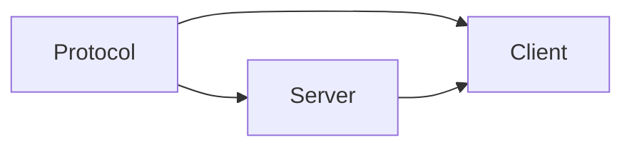
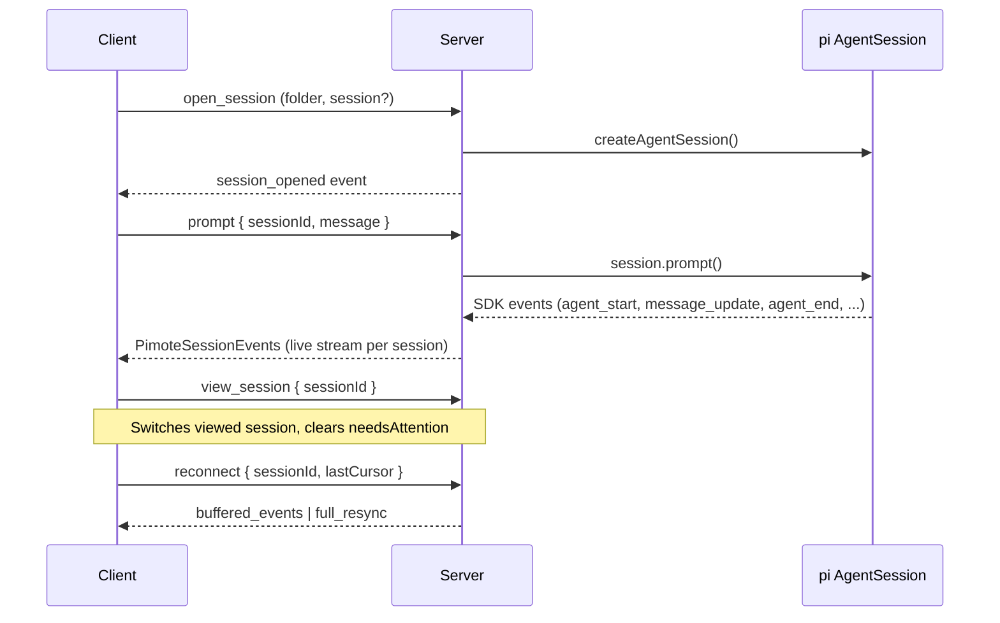
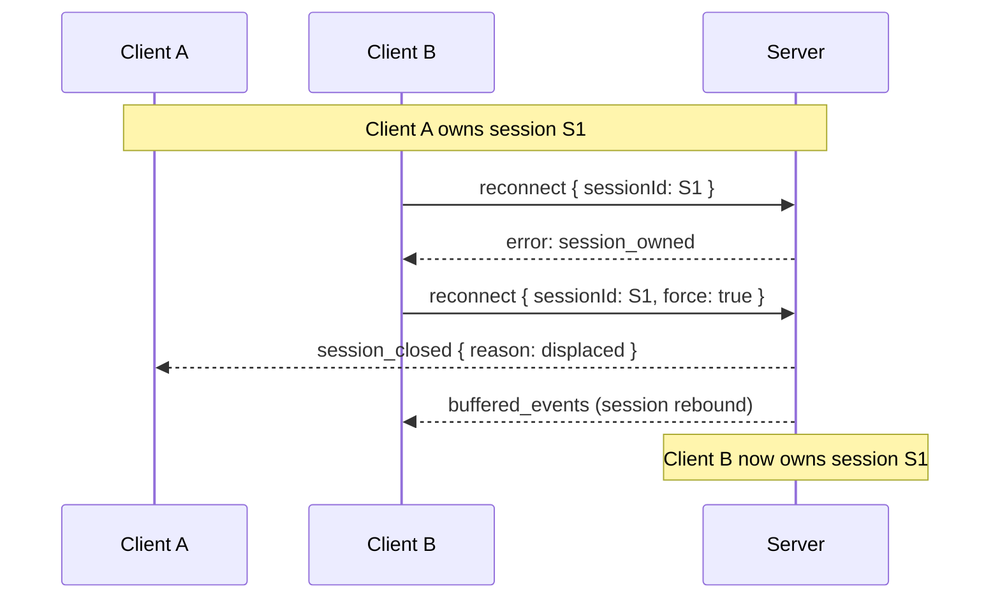
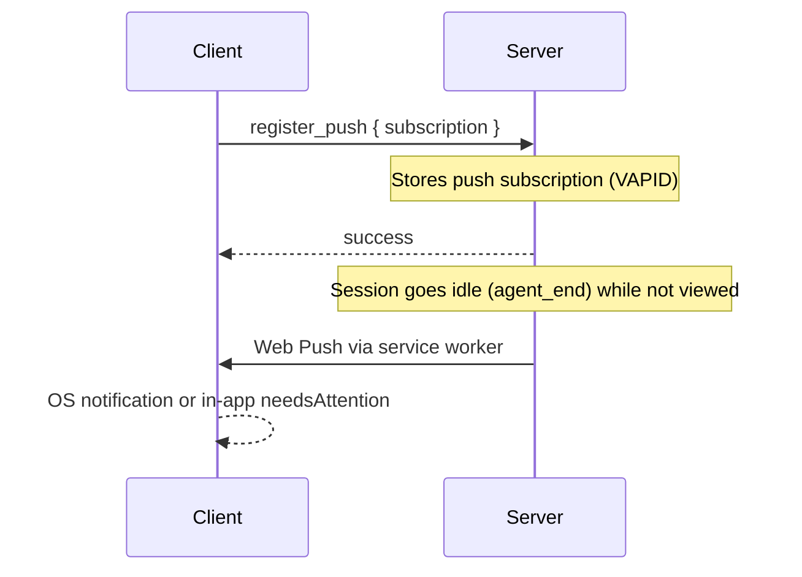
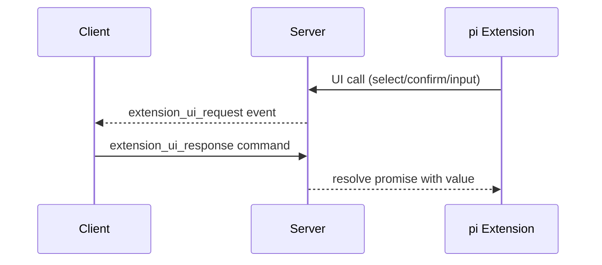

# Codemap

## Overview

Pimote is a PWA + Node.js server for remote access to pi (a coding agent). It uses an npm workspace with three packages: a shared protocol types library, a Node.js HTTP+WebSocket server that manages pi AgentSession instances, and a SvelteKit PWA client with Svelte 5 runes and shadcn-svelte for real-time conversation rendering. Supports multiple concurrent sessions with per-session state tracking, session conflict detection, client identity tracking for session ownership, and Web Push notifications when background sessions finish working.

### Key Flows

## Modules

### Protocol

Shared TypeScript types defining the WebSocket wire format between client and server.

**Responsibilities:** command types (client→server), event types (server→client), response envelope, session state shape, message content model, multi-session commands (view_session, register_push, unregister_push, kill_conflicting_processes, kill_conflicting_sessions), multi-session events (session_conflict with remoteSessions, session_closed with reason), enriched FolderInfo (activeSessionCount, activeStatus, externalProcessCount), enriched SessionInfo (isOwnedByMe, liveStatus), reconnect command with optional force flag for session takeover, push subscription record types

**Dependencies:** none

**Files:**
- `shared/src/**`

### Server

Node.js HTTP + WebSocket server that hosts pi AgentSession instances and bridges them to remote clients.

**Responsibilities:** HTTP static file serving and SPA fallback, WebSocket upgrade and message routing, client identity registry (Map<clientId, WsHandler> in server.ts — tracks connected clients for session ownership and cross-client messaging), session lifecycle (open/close/reconnect/idle-reap), pi SDK AgentSession creation and event subscription, event buffering with streaming delta coalescing for reconnect replay, folder/session discovery via filesystem scanning with enriched status (working/idle/attention per folder), extension UI bridging (dialog methods → WebSocket round-trips, fire-and-forget → events, TUI-only → no-ops), session takeover (find and kill external pi processes via /proc with optional PID filtering), configuration loading from ~/.config/pimote/config.json, multi-session WebSocket handler (per-client subscribed session set, per-session event routing, view_session tracking), per-session status tracking (idle/working via agent_start/agent_end, needsAttention flag), session ownership via ManagedSession.connectedClientId, session displacement on reconnect (reject if owned by another client unless force flag, notify displaced client with session_closed reason:displaced), kill_conflicting_sessions command (close remote sessions, notify owning clients with session_closed reason:killed), session conflict detection (find external pi processes and remote pimote sessions on open_session, send session_conflict events with both), list_sessions enrichment with isOwnedByMe and liveStatus per session, stale WebSocket handling (register-first-then-close, cleanup only if handler still current in registry), VAPID key auto-generation and persistence in config, push notification service (Web Push delivery to all subscriptions, subscription CRUD, expired endpoint cleanup), VAPID public key HTTP endpoint (/api/vapid-key), file-based push subscription storage with atomic writes

**Dependencies:** Protocol (wire format types)

**Files:**
- `server/src/index.ts` — entry point, wires up config, session manager, folder index, push notification service
- `server/src/config.ts` — config loading from ~/.config/pimote/config.json, VAPID key fields, ensureVapidKeys() auto-generation
- `server/src/server.ts` — HTTP server, static files, SPA fallback, /api/vapid-key endpoint, WebSocket upgrade with clientId extraction, client registry (Map<clientId, WsHandler>), stale connection displacement (register-first-then-close, cleanup gated on registry ownership)
- `server/src/ws-handler.ts` — per-connection WebSocket handler, multi-session subscription tracking (subscribedSessions set, viewedSessionId), routes commands to sessions, session conflict detection (external processes + remote pimote sessions), session displacement on reconnect (ownership check, force takeover, sendDisplacedEvent/sendKilledEvent), kill_conflicting_sessions command, list_sessions enrichment (isOwnedByMe, liveStatus), push registration, status change callbacks, extension UI response routing with session scoping
- `server/src/session-manager.ts` — ManagedSession lifecycle (open/close/reconnect/idle-reap), per-session status (idle/working) and needsAttention tracking, mutable sendLive/onStatusChange callbacks for reconnect re-binding
- `server/src/push-notification.ts` — PushNotificationService class (subscription CRUD, notifySessionIdle with expired endpoint cleanup), PushSender/SubscriptionStore interfaces
- `server/src/push-infrastructure.ts` — FilePushSubscriptionStore (JSON file with atomic rename), WebPushSender (web-push library wrapper with VAPID)
- `server/src/event-buffer.ts` — ring buffer for event replay on reconnect
- `server/src/extension-ui-bridge.ts` — maps pi SDK extension UI calls to WebSocket round-trips
- `server/src/folder-index.ts` — filesystem scanning for project folders and sessions
- `server/src/takeover.ts` — /proc scanning to find external pi processes, kill with optional PID filtering
- `server/src/event-buffer.test.ts`, `server/src/extension-ui-bridge.test.ts`, `server/src/folder-index.test.ts`, `server/src/push-notification.test.ts`, `server/src/takeover.test.ts` — tests

### Client

SvelteKit PWA that renders pi conversations in real time and provides session/folder browsing, model/thinking controls, and extension UI dialogs. Supports multiple concurrent sessions with a session registry, active session bar, push notifications, and session conflict handling.

**Responsibilities:** WebSocket connection management with auto-reconnect, per-session cursor tracking, and stable client identity (UUID clientId sent as WebSocket query param), SessionRegistry for multi-session state (replaces singleton session approach — maps sessionId to PerSessionState, routes events to correct session, tracks viewedSessionId), reactive per-session state (messages, streaming text, tool calls, model, thinking level, status, needsAttention, conflictingProcesses, conflictingRemoteSessions, pendingTakeover), folder and session index browsing, message rendering with markdown + syntax highlighting, streaming text and thinking block display, tool call visualization, model and thinking level pickers, extension UI dialog handling (select, confirm, input, editor) and status display, input bar with prompt/steer/follow-up/abort modes, ActiveSessionBar component (pill-style tabs with status dots for all open sessions, switch on click), NotificationBanner component (one-time prompt to enable push notifications after first session opens), service worker registration and push event handling (OS notifications when app not focused, in-app needsAttention marking when focused), session conflict UI (banner with Kill & Continue / Dismiss for detected external pi processes), session takeover UI (banner when reconnect rejected with session_owned — Take Over sends force reconnect, Dismiss drops session), handling session_closed with reason (displaced/killed removes session from registry), PWA manifest and service worker, shadcn-svelte UI primitives (button, badge, dialog, dropdown-menu, input, scroll-area, separator)

**Dependencies:** Protocol (wire format types), Server (WebSocket API)

**Files:**
- `client/src/lib/stores/session-registry.ts` — SessionRegistry class (pure logic: addSession, removeSession, switchTo, clearConflict, handleEvent routing by sessionId, PerSessionState shape)
- `client/src/lib/stores/session-registry.svelte.ts` — reactive singleton wrapping SessionRegistry in $state, wires connection events to registry, onSessionOwned handler (sets pendingTakeover), confirmTakeover (force reconnect) / dismissTakeover (drop session) exports, switchToSession helper (sends view_session to server)
- `client/src/lib/stores/session-registry.test.ts` — SessionRegistry tests
- `client/src/lib/stores/connection.svelte.ts` — ConnectionStore: WebSocket lifecycle with stable clientId (UUID query param), per-session cursor tracking (sessionCursors map), subscribedSessions set with add/remove, reconnects all subscribed sessions on WebSocket reopen, onSessionOwned callback for session_owned errors, forceReconnect method (reconnect with force:true for takeover)
- `client/src/lib/stores/session.svelte.ts` — legacy SessionStore (retained, event subscription removed)
- `client/src/lib/stores/index-store.svelte.ts` — folder/session index browsing state
- `client/src/lib/components/ActiveSessionBar.svelte` — horizontal pill bar showing all open sessions with status dots (working=green ping, attention=orange, idle=gray), click to switch
- `client/src/lib/components/NotificationBanner.svelte` — dismissable banner prompting push notification opt-in, handles VAPID key fetch, service worker subscription, register_push command
- `client/src/lib/components/StatusBar.svelte` — session status header
- `client/src/lib/components/MessageList.svelte` — scrollable message list
- `client/src/lib/components/InputBar.svelte` — prompt/steer/follow-up/abort input
- `client/src/lib/components/ModelPicker.svelte` — model selection dropdown
- `client/src/lib/components/ThinkingPicker.svelte` — thinking level dropdown
- `client/src/lib/components/FolderList.svelte` — folder browser with session counts and status indicators
- `client/src/lib/components/Message.svelte`, `client/src/lib/components/TextBlock.svelte`, `client/src/lib/components/ThinkingBlock.svelte`, `client/src/lib/components/ToolCall.svelte`, `client/src/lib/components/StreamingIndicator.svelte` — message rendering
- `client/src/lib/components/ExtensionDialog.svelte`, `client/src/lib/components/ExtensionStatus.svelte` — extension UI
- `client/src/lib/components/CompactButton.svelte`, `client/src/lib/components/SessionItem.svelte` — shared UI components
- `client/src/lib/components/ui/**` — shadcn-svelte primitives (button, badge, dialog, dropdown-menu, input, scroll-area, separator)
- `client/src/lib/markdown.ts` — markdown rendering with syntax highlighting
- `client/src/lib/highlight-theme.css` — syntax highlight theme
- `client/src/lib/utils.ts`, `client/src/lib/index.ts` — utilities
- `client/src/routes/+layout.svelte` — app shell, connection init, service worker registration, push message listener
- `client/src/routes/+layout.ts`, `client/src/routes/layout.css` — layout config and styles
- `client/src/routes/+page.svelte` — main page: session view (StatusBar, takeover banner, conflict banner, MessageList, ActiveSessionBar, InputBar) or landing (NotificationBanner, FolderList, ActiveSessionBar)
- `client/static/sw.js` — service worker: push event handler (shows OS notification or posts in-app message), notification click handler
- `client/static/manifest.json`, `client/static/icon-192.png`, `client/static/icon-512.png`, `client/static/robots.txt` — PWA assets
- `client/svelte.config.js`, `client/vite.config.ts`, `client/components.json` — build config
- `client/src/app.html`, `client/src/app.d.ts` — SvelteKit app shell
