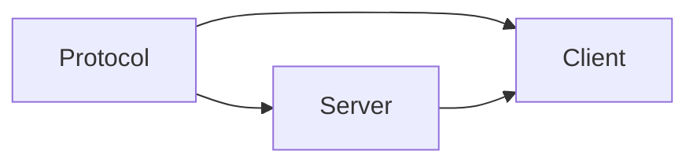
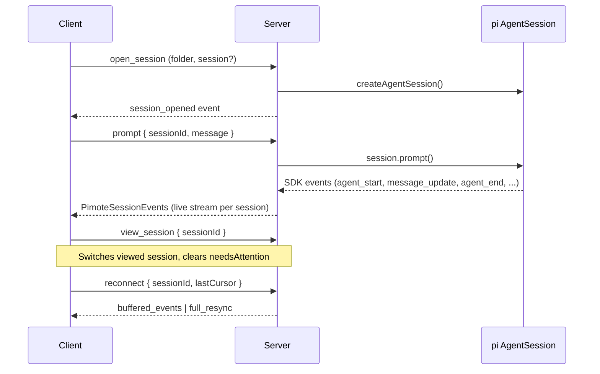
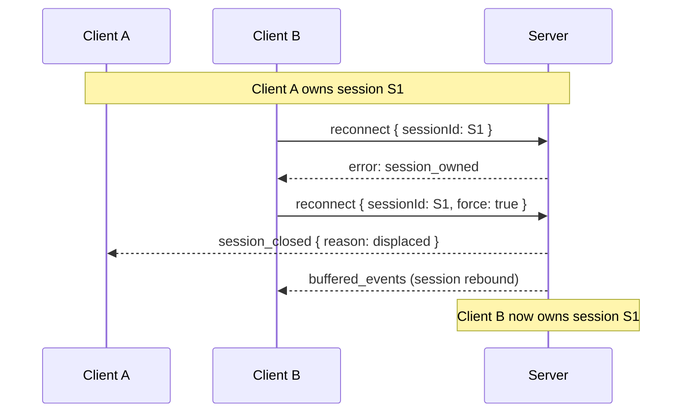
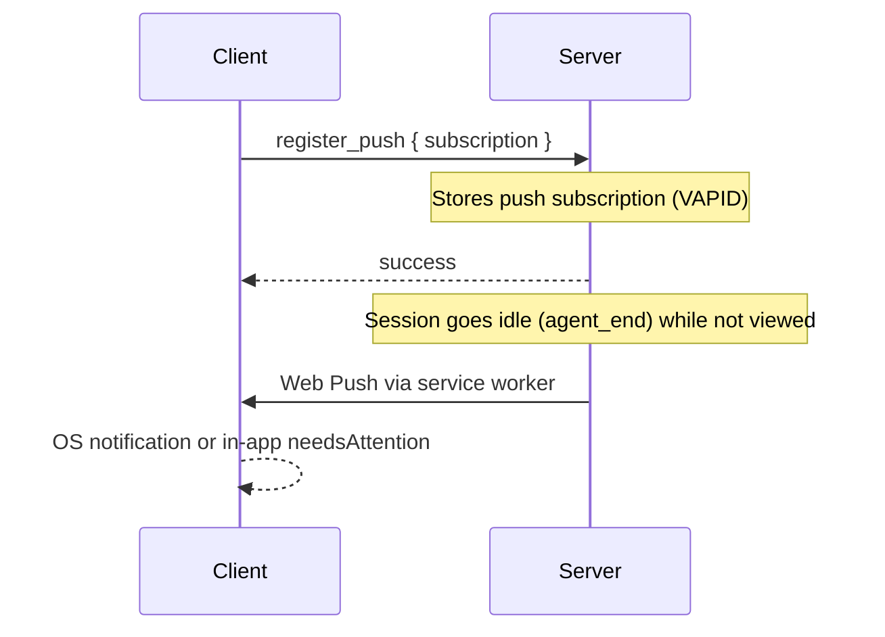
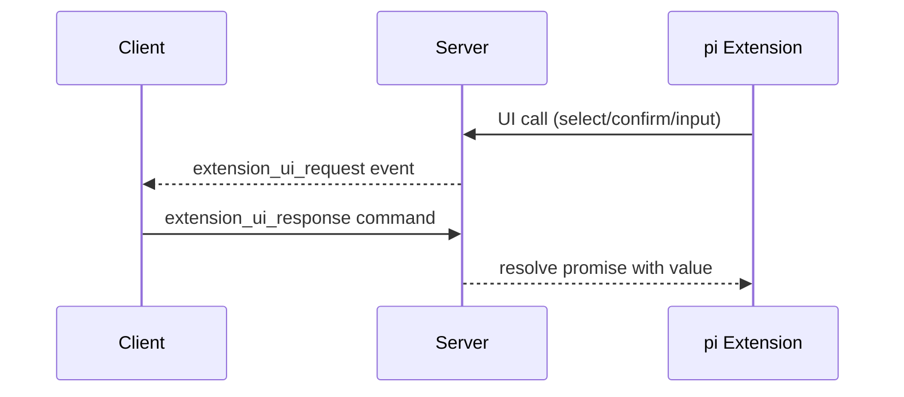

# Codemap

## Overview

Pimote is a PWA + Node.js server for remote access to pi (a coding agent). It uses an npm workspace with three packages: a shared protocol types library, a Node.js HTTP+WebSocket server that manages pi AgentSession instances, and a SvelteKit PWA client with Svelte 5 runes and shadcn-svelte for real-time conversation rendering. Supports multiple concurrent sessions with per-session state tracking, session conflict detection, client identity tracking for session ownership, Web Push notifications when background sessions finish working, and extension UI bridging (inline select/confirm, modal dialogs).

### Key Flows

## Modules

### Protocol

Shared TypeScript types defining the WebSocket wire format between client and server.

**Responsibilities:** command types (client→server), event types (server→client), response envelope, session state shape, message content model (PimoteMessageContent with optional streaming flag), simplified PimoteAgentMessage (JSON-serializable, no SDK dependency), StreamingMessage interface (shared shape for in-progress and finalized messages), MessageUpdateEvent with contentIndex, subtype (start/delta/end), and optional tool call metadata (toolCallId, toolName), multi-session commands (view_session, register_push, unregister_push, kill_conflicting_processes, kill_conflicting_sessions), multi-session events (session_conflict with remoteSessions, session_closed with reason), enriched FolderInfo (activeSessionCount, externalProcessCount), enriched SessionInfo (isOwnedByMe, liveStatus), reconnect command with optional force flag for session takeover, push subscription record types, session meta (git branch, context usage), auto-retry events, auto-compaction events, extension error events, version mismatch detection, extension UI request/response types, slash command types (get_commands/complete_args commands, CommandInfo, CompleteArgsCommand, AutocompleteResponseItem)

**Dependencies:** none

**Files:**

- `shared/src/**`

### Server

Node.js HTTP + WebSocket server that hosts pi AgentSession instances and bridges them to remote clients.

**Responsibilities:** HTTP static file serving and SPA fallback, WebSocket upgrade and message routing, client identity registry (Map<clientId, WsHandler> in server.ts — tracks connected clients for session ownership and cross-client messaging), client version checking (version_mismatch event on connect if client is stale), session lifecycle (open/close/reconnect/idle-reap), pi SDK AgentSession creation and event subscription (including extension model provider registration on open), event buffering with streaming delta coalescing for reconnect replay, folder/session discovery via filesystem scanning with enriched status (working/idle/attention per folder), extension UI bridging (dialog methods → WebSocket round-trips, fire-and-forget → events, TUI-only → no-ops, stale pending UI cleanup on abort/timeout/session close), extension command context actions (waitForIdle, newSession, fork, navigateTree, switchSession, reload), SDK message mapping (AgentMessage → PimoteAgentMessage for both bulk retrieval and live events), session takeover (find and kill external pi processes via /proc with optional PID filtering), configuration loading from ~/.config/pimote/config.json, multi-session WebSocket handler (per-client subscribed session set, per-session event routing, view_session tracking), per-session status tracking (idle/working via agent_start/agent_end, needsAttention flag), session ownership via ManagedSession.connectedClientId, session displacement on reconnect (reject if owned by another client unless force flag, notify displaced client with session_closed reason:displaced), kill_conflicting_sessions command (close remote sessions, notify owning clients with session_closed reason:killed), session conflict detection (find external pi processes and remote pimote sessions on open_session, send session_conflict events with both), list_sessions enrichment with isOwnedByMe and liveStatus per session, stale WebSocket handling (register-first-then-close, cleanup only if handler still current in registry), VAPID key auto-generation and persistence in config, push notification service (Web Push delivery to all subscriptions, subscription CRUD, expired endpoint cleanup), VAPID public key HTTP endpoint (/api/vapid-key), file-based push subscription storage with atomic writes, git branch detection, session meta retrieval (git branch, context usage), slash command handling (get_commands assembles commands from skills, templates, and extension commands; complete_args dispatches to command-specific argument completion), session adopt carries over extensionsBound flag

**Dependencies:** Protocol (wire format types)

**Files:**

- `server/src/index.ts` — entry point, wires up config, session manager, folder index, push notification service
- `server/src/config.ts` — config loading from ~/.config/pimote/config.json, VAPID key fields, ensureVapidKeys() auto-generation
- `server/src/server.ts` — HTTP server, static files, SPA fallback, /api/vapid-key endpoint, WebSocket upgrade with clientId extraction, client registry (Map<clientId, WsHandler>), client version checking, stale connection displacement (register-first-then-close, cleanup gated on registry ownership)
- `server/src/ws-handler.ts` — per-connection WebSocket handler, multi-session subscription tracking (subscribedSessions set, viewedSessionId), routes commands to sessions, session conflict detection (external processes + remote pimote sessions), session displacement on reconnect (ownership check, force takeover, sendDisplacedEvent/sendKilledEvent), kill_conflicting_sessions command, list_sessions enrichment (isOwnedByMe, liveStatus), push registration, status change callbacks, extension UI response routing with session scoping, extension command context actions (waitForIdle, newSession, fork, navigateTree, switchSession, reload), git branch resolution, session meta (git branch + context usage), get_commands handler (assembles from skills, prompt templates, extension commands), complete_args handler (async argument completion via command.getArgumentCompletions), session_replaced carries extensionsBound across adopt
- `server/src/session-manager.ts` — ManagedSession lifecycle (open/close/reconnect/idle-reap), per-session status (idle/working) and needsAttention tracking, mutable sendLive/onStatusChange callbacks for reconnect re-binding, extension model provider registration on session open, resolves all pending UI responses on session close, adoptSession accepts extensionsBound option for session reuse
- `server/src/message-mapper.ts` — converts pi SDK AgentMessage objects to PimoteAgentMessage format, handles text/thinking/toolCall/image/toolResult content types, used for both bulk get_messages and live message_end events
- `server/src/push-notification.ts` — PushNotificationService class (subscription CRUD, notifySessionIdle with expired endpoint cleanup), PushSender/SubscriptionStore interfaces
- `server/src/push-infrastructure.ts` — FilePushSubscriptionStore (JSON file with atomic rename), WebPushSender (web-push library wrapper with VAPID)
- `server/src/event-buffer.ts` — ring buffer for event replay on reconnect, maps SDK events to PimoteSessionEvent wire format (extracts contentIndex, content type, and subtype from SDK assistantMessageEvent, extracts tool call metadata from partial message on toolcall_start), coalesces streaming deltas (message_update, tool_execution_update dropped from replay buffer)
- `server/src/extension-ui-bridge.ts` — maps pi SDK extension UI calls to WebSocket round-trips, cleans up stale pending UI entries on abort/timeout (prevents replay of dead requests on reconnect)
- `server/src/folder-index.ts` — filesystem scanning for project folders and sessions
- `server/src/takeover.ts` — /proc scanning to find external pi processes, kill with optional PID filtering
- `server/src/event-buffer.test.ts`, `server/src/extension-ui-bridge.test.ts`, `server/src/folder-index.test.ts`, `server/src/push-notification.test.ts`, `server/src/session-manager.test.ts`, `server/src/takeover.test.ts`, `server/src/ws-handler.test.ts` — tests

### Client

SvelteKit PWA that renders pi conversations in real time and provides session/folder browsing, model/thinking controls, extension UI (inline + modal), and push notifications. Supports multiple concurrent sessions with a session registry, active session bar, and session conflict handling.

**Responsibilities:** WebSocket connection management with auto-reconnect (phases: backoff with countdown → connecting → syncing per-session → ready), per-session cursor tracking, stable client identity (UUID clientId sent as WebSocket query param), client version sent on connect for mismatch detection (auto-reloads on version_mismatch), SessionRegistry for multi-session state (maps sessionId to PerSessionState, routes events to correct session, tracks viewedSessionId), reactive per-session state via $state() runes on class fields (messages, streamingMessage with ordered content blocks, streamingKey, messageKeys for stable DOM keying, tool calls, model, thinking level, status, needsAttention, conflictingProcesses, conflictingRemoteSessions, pendingTakeover, gitBranch, contextUsage, draftText), session lifecycle helpers (closeSession, newSessionInProject, confirmTakeover, dismissTakeover, switchToSession), session adoption from push notification clicks (pendingAdopt → onSessionAdopted), folder and session index browsing, streaming content rendering with unified message loop (finalized + streaming entries with stable keys, per-block streaming flag, incremental smd rendering, auto-scroll), show-more collapsible pattern for long tool output and custom messages, message rendering with streaming-markdown (smd) incremental DOM rendering + highlight.js syntax highlighting, tool call visualization with streaming args and results, model and thinking level pickers, extension UI queue (shared reactive store routing extension_ui_request events, filtering fire-and-forget methods, splitting inline vs. modal requests by viewed session), inline extension UI panel (select with keyboard nav 1-9/arrows/enter, confirm with Y/N, both with Esc cancel), modal extension dialog handling (input, editor), extension status display, input bar with prompt/steer/follow-up/abort modes, per-session draft persistence, and slash command autocomplete (/ triggers command list, Tab/Enter to select, server-side argument completions with debounce), command store (reactive per-session command cache fetched on session connect, cleaned up on close), fuzzy matching utility (character-in-order matching with word boundary bonuses and gap penalties, space-separated token support), ActiveSessionBar component (pill-style tabs with status dots for all open sessions, switch on click), NotificationBanner component (one-time prompt to enable push notifications after first session opens), InstallBanner component (PWA install prompt — Android beforeinstallprompt, iOS Safari share instructions, dismissable), service worker (TypeScript, compiled via VitePWA injectManifest — push notification handler with focused-window in-app routing vs. OS notification, notification click handler with session adoption), PWA manifest, shadcn-svelte UI primitives (button, badge, dialog, dropdown-menu, input, scroll-area, separator)

**Dependencies:** Protocol (wire format types), Server (WebSocket API)

**Files:**

- `client/src/lib/stores/session-registry.svelte.ts` — SessionRegistry class with $state() runes on class fields (sessions record, viewedSessionId), event routing by sessionId (handleEvent dispatches agent lifecycle, message streaming, tool execution, compaction, resync, conflict events), streaming message accumulation via streamingMessage (StreamingMessage object with ordered content blocks), streamingKey (stable DOM key for the in-progress message), messageKeys array for stable DOM keying of finalized messages, \_nextMessageKey counter and generateMessageKeys() for batch key generation, per-contentIndex message_update handling (start creates block with streaming flag, delta appends text, end clears streaming flag), message_end promotes streamingKey to messageKeys and replaces streamingMessage with finalized PimoteAgentMessage, session lifecycle (addSession, removeSession, switchTo, clearConflict, rebuildToolExecutions), meta updates (gitBranch, contextUsage), wired to connection events at module level (session_opened → addSession + fetch initial state/messages/meta/commands, session_closed → removeSession + commandStore.removeSession, session_replaced → commandStore cleanup + re-fetch), onSessionOwned → pendingTakeover, onSessionAdopted → add + switch + view, onReconnected → restore viewed session. Exports: confirmTakeover, dismissTakeover, switchToSession, closeSession, newSessionInProject
- `client/src/lib/stores/session-registry.test.ts` — SessionRegistry tests
- `client/src/lib/stores/connection.svelte.ts` — ConnectionStore: WebSocket lifecycle with stable clientId (UUID query param) and version param, reconnect phases (backoff with countdown → connecting → syncing → ready), per-session cursor tracking (sessionCursors map), subscribedSessions set with add/remove, reconnects all subscribed sessions on WebSocket reopen (fires synthetic session_closed for expired sessions), onSessionOwned callback for session_owned errors, pendingAdopt/onSessionAdopted for notification-initiated session adoption, auto-reloads on version_mismatch event, re-registers push subscription on every connect
- `client/src/lib/stores/extension-ui-queue.svelte.ts` — shared reactive queue for extension UI requests, filters fire-and-forget methods (setStatus, setWidget, notify, setEditorText, setTitle), splits inline methods (select, confirm) from modal methods, scoped to viewed session, sendResponse helper
- `client/src/lib/stores/input-bar.svelte.ts` — reactive editorTextRequest store ($state with text + seq counter) for extension setEditorText integration
- `client/src/lib/stores/index-store.svelte.ts` — folder/session index browsing state
- `client/src/lib/components/ActiveSessionBar.svelte` — horizontal pill bar showing all open sessions with status dots (working=green ping, attention=orange, idle=gray), click to switch
- `client/src/lib/components/NotificationBanner.svelte` — dismissable banner prompting push notification opt-in, handles VAPID key fetch, service worker subscription, register_push command
- `client/src/lib/components/InstallBanner.svelte` — PWA install prompt (Android: beforeinstallprompt with Install button, iOS Safari: share instructions, dismissable via localStorage)
- `client/src/lib/components/InlineSelect.svelte` — inline extension UI panel for select (numbered options with keyboard nav: 1-9 hotkeys, arrow keys, Enter) and confirm (Y/N keys) methods, scoped to viewed session via extension-ui-queue
- `client/src/lib/components/StatusBar.svelte` — session status header (git branch, context usage, model, connection phase)
- `client/src/lib/components/CommandAutocomplete.svelte` — popup autocomplete panel for slash commands, two modes: command mode (fuzzy-filtered command list) and args mode (server-fetched completions with debounce), keyboard navigation (up/down/Tab/Enter/Escape), exports moveUp/moveDown/accept/dismiss methods for parent control
- `client/src/lib/components/InputBar.svelte` — prompt/steer/follow-up/abort input with per-session draft persistence, slash command autocomplete integration (/ prefix detection, mode switching between command/args, keyboard interception for autocomplete navigation)
- `client/src/lib/components/ModelPicker.svelte` — model selection dropdown
- `client/src/lib/components/ThinkingPicker.svelte` — thinking level dropdown
- `client/src/lib/components/FolderList.svelte` — folder browser with session counts and status indicators
- `client/src/lib/components/Message.svelte` — renders user, assistant, custom, and system messages; assistant messages use unified content loop with per-block streaming prop from content.streaming; custom messages use StreamingCollapsible during streaming, collapsible toggle when finalized
- `client/src/lib/components/MessageList.svelte` — scrollable message list, builds unified displayEntries (finalized messages + streaming message) with stable keys, auto-scroll tracks streaming content changes
- `client/src/lib/components/TextBlock.svelte` — markdown text block using streaming-markdown (smd) for incremental append-only DOM rendering; creates parser per content block, writes deltas via parser_write, ends on streaming=false; no debounce or re-parse
- `client/src/lib/components/ThinkingBlock.svelte` — collapsible thinking block, auto-expands on streaming start, auto-collapses on end, auto-scrolls content to bottom during streaming
- `client/src/lib/components/ToolCall.svelte` — tool call display with collapsible args/result sections, uses StreamingCollapsible for args and result, shows streaming tool call args as raw text before content.args is populated
- `client/src/lib/components/StreamingCollapsible.svelte` — reusable collapsible pre block with show-more/less toggle (line-count threshold), auto-scroll to bottom during streaming, configurable accent color
- `client/src/lib/components/StreamingIndicator.svelte` — animated dots shown when agent is working but no content yet
- `client/src/lib/components/ExtensionDialog.svelte`, `client/src/lib/components/ExtensionStatus.svelte` — extension UI (modal dialogs and status display)
- `client/src/lib/components/SessionItem.svelte` — session list item in folder browser
- `client/src/lib/components/ui/**` — shadcn-svelte primitives (button, badge, dialog, dropdown-menu, input, scroll-area, separator)
- `client/src/lib/smd-renderer.ts` — createRenderer(container) factory wrapping smd's default_renderer with highlight.js code block highlighting on end_token and URL scheme allowlisting (https/mailto) in set_attr
- `client/src/lib/smd-renderer.test.ts` — smd-renderer tests
- `client/src/lib/highlight-theme.css` — syntax highlight theme
- `client/src/lib/fuzzy.ts` — fuzzy matching utility (character-in-order matching with word boundary bonuses, gap penalties, consecutive match rewards, alpha-numeric swap fallback), fuzzyFilter for multi-token filtering and sorting
- `client/src/lib/fuzzy.test.ts` — fuzzy matching tests
- `client/src/lib/stores/command-store.svelte.ts` — reactive per-session command cache using SvelteMap, singleton export (commandStore), fetched on session connect, cleaned up on close/replace
- `client/src/lib/stores/command-store.test.ts` — command store tests
- `client/src/lib/utils.ts`, `client/src/lib/index.ts` — utilities
- `client/src/sw.ts` — service worker source (TypeScript, compiled via VitePWA injectManifest): push event handler (shows OS notification when unfocused, posts in-app message when focused), notification click handler (focuses existing window or opens new, posts session adoption message)
- `client/src/routes/+layout.svelte` — app shell, connection init, service worker registration, push message listener, notification click adoption
- `client/src/routes/+layout.ts`, `client/src/routes/layout.css` — layout config and styles
- `client/src/routes/+page.svelte` — main page: session view (StatusBar, takeover banner, conflict banner, MessageList, InlineSelect, ActiveSessionBar, InputBar) or landing (NotificationBanner, FolderList, ActiveSessionBar)
- `client/src/test/mocks/app-environment.ts` — test mock for $app/environment
- `client/static/manifest.json`, `client/static/icon-192.png`, `client/static/icon-512.png`, `client/static/robots.txt` — PWA assets
- `client/svelte.config.js`, `client/vite.config.ts`, `client/components.json` — build config (vite.config uses VitePWA injectManifest strategy for sw.ts compilation)
- `client/src/app.html`, `client/src/app.d.ts` — SvelteKit app shell
