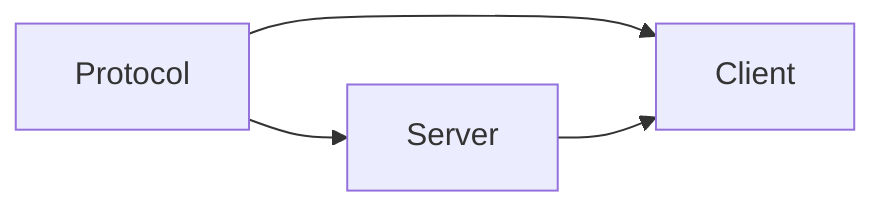
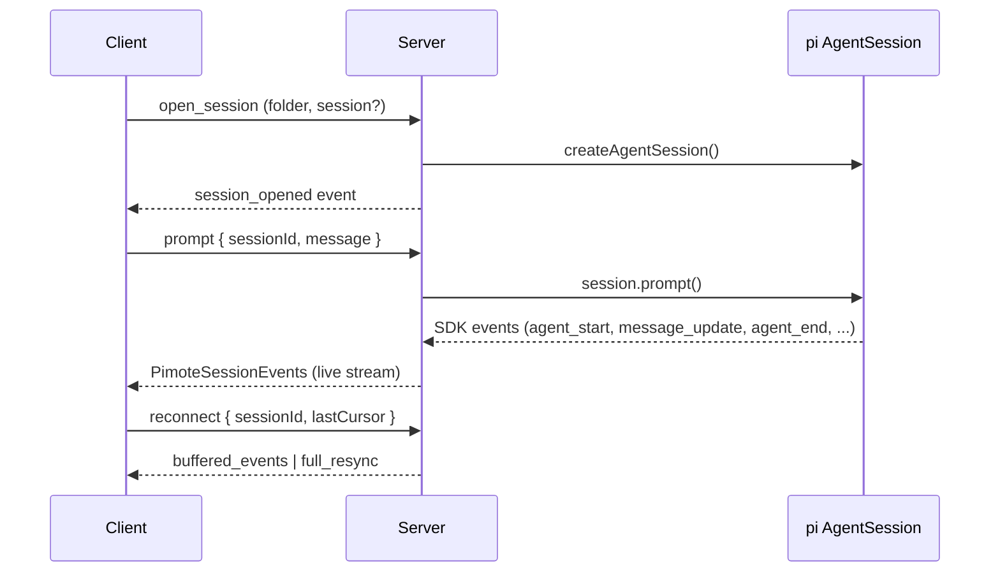
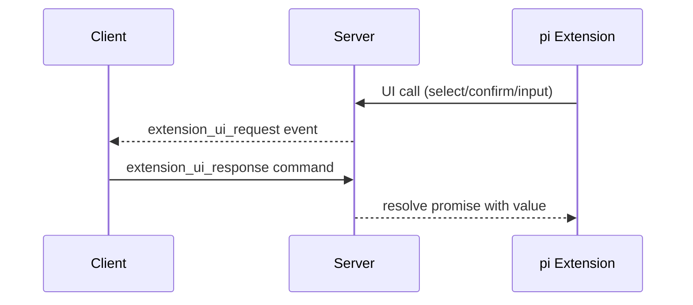

# Codemap

## Overview

Pimote is a PWA + Node.js server for remote access to pi (a coding agent). npm workspace with three packages: shared protocol types, a Node.js HTTP+WebSocket server managing pi AgentSession instances, and a SvelteKit PWA client (Svelte 5 runes, shadcn-svelte) for real-time conversation rendering. Supports multiple concurrent sessions, session ownership/takeover, Web Push notifications, and extension UI bridging.

### Key Flows

## Modules

### Protocol

Shared TypeScript types defining the WebSocket wire format between client and server.

**Responsibilities:** command types (client→server), event types (server→client), response envelope, session/message/folder data shapes, push subscription types, extension UI request/response types, slash command types

**Dependencies:** none

**Files:**

- `shared/src/**`

### Server

Node.js HTTP + WebSocket server that hosts pi AgentSession instances and bridges them to remote clients.

**Responsibilities:** HTTP static serving + SPA fallback, WebSocket upgrade + message routing, client identity registry, session lifecycle (open/close/reconnect/idle-reap/takeover), pi SDK session creation + event subscription, event buffering with delta coalescing for reconnect replay, folder/session filesystem discovery, extension UI bridging (dialog→WebSocket round-trips, fire-and-forget→events, TUI-only→no-ops), extension command context actions, SDK message mapping, session conflict detection (external pi processes via /proc + remote pimote sessions), config loading + VAPID key management, Web Push notification delivery, git branch detection, slash command/autocomplete handling, client version mismatch detection

**Dependencies:** Protocol (wire format types)

**Files:**

- `server/src/index.ts` — entry point
- `server/src/config.ts` — config loading, VAPID key auto-generation
- `server/src/server.ts` — HTTP server, static files, WebSocket upgrade, client registry, version checking
- `server/src/ws-handler.ts` — per-connection command handler, multi-session routing, session ownership/displacement, conflict detection
- `server/src/session-manager.ts` — ManagedSession lifecycle, status tracking, event subscription, idle reaping
- `server/src/event-buffer.ts` — ring buffer, SDK→wire event mapping, streaming delta coalescing
- `server/src/message-mapper.ts` — SDK AgentMessage → PimoteAgentMessage conversion
- `server/src/extension-ui-bridge.ts` — extension UI calls → WebSocket events
- `server/src/folder-index.ts` — filesystem scanning for project folders and sessions
- `server/src/takeover.ts` — /proc scanning for external pi processes, kill with SIGTERM/SIGKILL
- `server/src/push-notification.ts` — PushNotificationService, subscription CRUD, delivery
- `server/src/push-infrastructure.ts` — FilePushSubscriptionStore, WebPushSender
- `server/src/**/*.test.ts` — tests

### Client

SvelteKit PWA rendering pi conversations in real time with session/folder browsing, model/thinking controls, extension UI, and push notifications.

**Responsibilities:** WebSocket connection with auto-reconnect (backoff→connecting→syncing→ready), per-session cursor tracking, stable client identity, multi-session state management (SessionRegistry with $state() runes), streaming message accumulation with stable DOM keying, folder/session index browsing, streaming markdown rendering (smd + highlight.js), tool call visualization, model/thinking pickers, extension UI queue (inline select/confirm + modal input/editor), input bar with prompt/steer/follow-up/abort modes + slash command autocomplete, per-session draft persistence, fuzzy matching, service worker for push notifications, PWA install prompt, active session bar with status indicators

**Dependencies:** Protocol (wire format types), Server (WebSocket API)

**Files:**

- `client/src/lib/stores/connection.svelte.ts` — WebSocket lifecycle, reconnect phases, cursor tracking, push re-registration
- `client/src/lib/stores/session-registry.svelte.ts` — SessionRegistry class, event routing, streaming message accumulation, session lifecycle helpers
- `client/src/lib/stores/session-registry.test.ts` — tests
- `client/src/lib/stores/index-store.svelte.ts` — folder/session index browsing state
- `client/src/lib/stores/command-store.svelte.ts` — per-session command cache
- `client/src/lib/stores/command-store.test.ts` — tests
- `client/src/lib/stores/extension-ui-queue.svelte.ts` — extension UI request queue, inline vs modal routing
- `client/src/lib/stores/input-bar.svelte.ts` — editorTextRequest store for extension setEditorText
- `client/src/lib/components/MessageList.svelte` — scrollable message list with unified display entries and auto-scroll
- `client/src/lib/components/Message.svelte` — message rendering (user, assistant, custom, system)
- `client/src/lib/components/TextBlock.svelte` — streaming markdown rendering via smd
- `client/src/lib/components/ThinkingBlock.svelte` — collapsible thinking block
- `client/src/lib/components/ToolCall.svelte` — tool call display with streaming args/results
- `client/src/lib/components/StreamingCollapsible.svelte` — reusable collapsible pre block with show-more/less
- `client/src/lib/components/StreamingIndicator.svelte` — animated working dots
- `client/src/lib/components/InputBar.svelte` — prompt input with slash command integration
- `client/src/lib/components/CommandAutocomplete.svelte` — slash command autocomplete popup
- `client/src/lib/components/InlineSelect.svelte` — inline extension UI (select with 1-9/arrows, confirm with Y/N)
- `client/src/lib/components/ExtensionDialog.svelte` — modal extension UI (input, editor)
- `client/src/lib/components/ExtensionStatus.svelte` — extension status display
- `client/src/lib/components/StatusBar.svelte` — session status header
- `client/src/lib/components/ActiveSessionBar.svelte` — session tab bar with status dots
- `client/src/lib/components/FolderList.svelte` — folder browser
- `client/src/lib/components/SessionItem.svelte` — session list item
- `client/src/lib/components/ModelPicker.svelte` — model selection dropdown
- `client/src/lib/components/ThinkingPicker.svelte` — thinking level dropdown
- `client/src/lib/components/NotificationBanner.svelte` — push notification opt-in prompt
- `client/src/lib/components/InstallBanner.svelte` — PWA install prompt
- `client/src/lib/components/PendingSteeringMessages.svelte` — pending steering message display
- `client/src/lib/components/ui/**` — shadcn-svelte primitives (button, badge, dialog, dropdown-menu, input, scroll-area, separator)
- `client/src/lib/smd-renderer.ts` — streaming-markdown renderer with highlight.js and URL scheme allowlisting
- `client/src/lib/smd-renderer.test.ts`, `client/src/lib/smd-underscore-fix.test.ts` — tests
- `client/src/lib/fuzzy.ts` — fuzzy matching utility
- `client/src/lib/fuzzy.test.ts` — tests
- `client/src/lib/utils.ts`, `client/src/lib/index.ts` — utilities
- `client/src/lib/highlight-theme.css` — syntax highlight theme
- `client/src/sw.ts` — service worker (push notifications, notification click handling)
- `client/src/routes/+page.svelte` — main page (session view or landing)
- `client/src/routes/+layout.svelte` — app shell, connection init, service worker registration
- `client/src/routes/+layout.ts`, `client/src/routes/layout.css` — layout config and styles
- `client/src/app.html`, `client/src/app.d.ts` — SvelteKit app shell
- `client/src/test/mocks/app-environment.ts` — test mock
- `client/static/**` — Static assets (PWA manifest & icons, robots.txt)
- `client/svelte.config.js`, `client/vite.config.ts`, `client/vitest.config.ts` — build config
