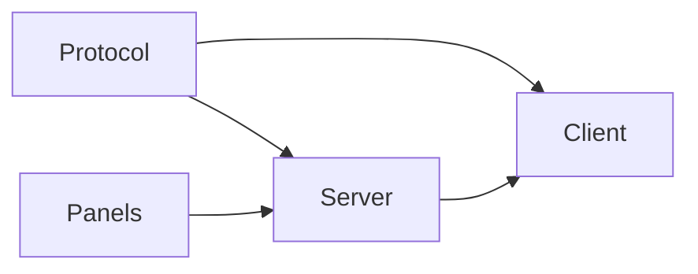
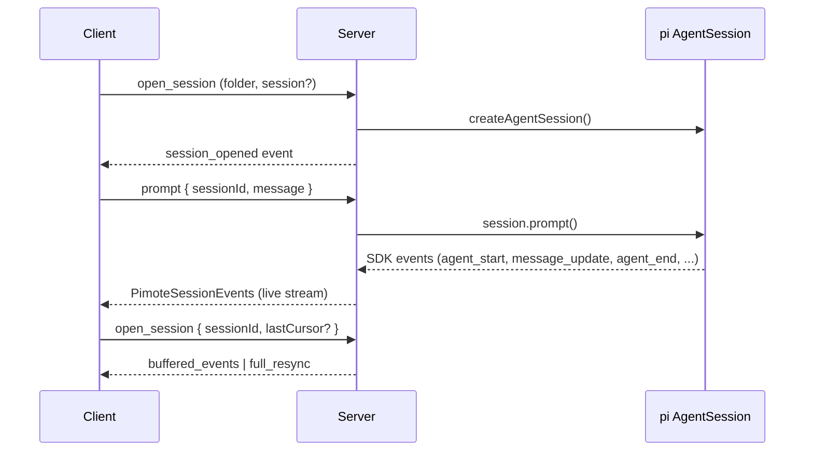
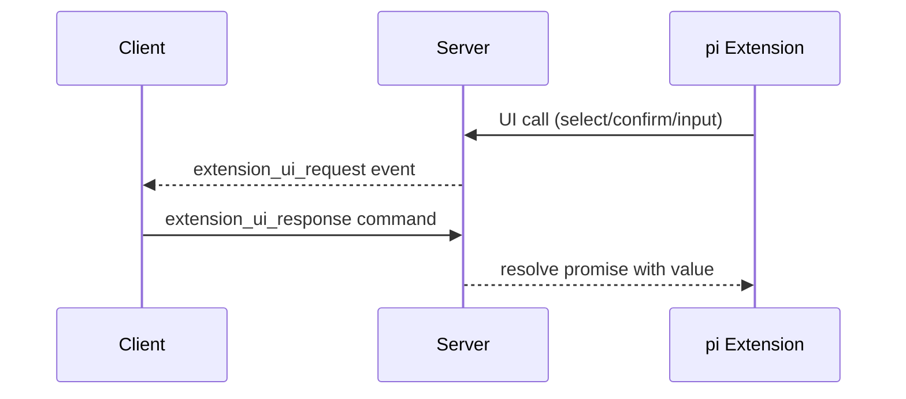

# Codemap

## Overview

Pimote is a PWA + Node.js server for remote access to pi (a coding agent). npm workspace with four packages: shared protocol types, a Node.js HTTP+WebSocket server managing pi AgentSession instances, a SvelteKit PWA client (Svelte 5 runes, shadcn-svelte) for real-time conversation rendering, and a panels library for extensions to push structured card data. Supports multiple concurrent sessions, session ownership/takeover, Web Push notifications, extension UI bridging, and a real-time side panel displaying extension-provided cards.

### Key Flows

## Modules

### Protocol

Shared TypeScript types defining the WebSocket wire format between client and server.

**Responsibilities:** command types (client→server), event types (server→client), response envelope, session/message/folder data shapes, push subscription types, extension UI request/response types, slash command types, tree navigation wire contracts (`PimoteTreeNode`, `navigate_tree`/`set_tree_label`, `tree_navigation_start`/`tree_navigation_end`), project management commands (`create_project`), panel/card data types (Card, BodySection, CardColor, BodySectionStyle, PanelUpdateEvent)

**Dependencies:** none

**Files:**

- `shared/src/protocol.ts` — full wire protocol contracts and discriminated unions (including tree navigation types/events)
- `shared/src/index.ts` — protocol re-exports

### Server

Node.js HTTP + WebSocket server that hosts pi AgentSession instances and bridges them to remote clients.

**Responsibilities:** HTTP static serving + SPA fallback, WebSocket upgrade + message routing, client identity registry, three-layer session model (ManagedSlot wrapping AgentSessionRuntime + ClientConnection + SessionState), runtime factory pattern for pi SDK session creation, session state lifecycle helpers (create/teardown/rebuild), session open/close/resume/idle-reap/takeover, event buffering with delta coalescing for reconnect replay, folder/session filesystem discovery, project folder creation (`mkdir` + `git init`), extension UI bridging (dialog→WebSocket round-trips, fire-and-forget→events, TUI-only→no-ops), extension command context actions, SDK message mapping, session conflict detection (external pi processes via /proc + remote pimote sessions), config loading + VAPID key management, Web Push notification delivery, git branch detection, pimote slash-command handling (`/new`, `/reload`, `/tree`) plus autocomplete surfaces for extension/skill/template commands, tree navigation command lifecycle (`navigate_tree`, `set_tree_label`) with buffered lifecycle events + full-resync handoff, client version mismatch detection, EventBus creation + panel channel wiring (detect/data listeners), per-session panel state tracking with throttled pushes, panel snapshot delivery on reconnect/session-switch, idle-reap protection while tree navigation is in progress

**Dependencies:** Protocol (wire format types)

**Files:**

- `server/src/index.ts` — entry point
- `server/src/config.ts` — config loading, VAPID key auto-generation
- `server/src/server.ts` — HTTP server, static files, WebSocket upgrade, client registry, version checking
- `server/src/ws-handler.ts` — per-connection command handler, multi-session routing, session ownership/displacement, conflict detection, `/tree` prompt interception + session-tree mapping, `navigate_tree`/`set_tree_label` handlers with `tree_navigation_start`/`tree_navigation_end` event emission and full-resync orchestration, in-place session reset via slot.runtime (newSession/fork/switchSession with rebuildSessionState + reKey), `create_project` handler (name/root validation, `mkdir` + `git init`), `list_folders` response includes configured roots
- `server/src/session-manager.ts` — ManagedSlot/ClientConnection/SessionState types, slot-based event + UI helpers (send, wait, resolve, replay), AgentSessionRuntime factory for session creation, session state lifecycle (createSessionState/teardownSessionState/rebuildSessionState), `treeNavigationInProgress` state tracking, reKeySession for session replacement, idle reaping with tree-navigation skip protection, EventBus creation + panel listener wiring, throttled panel push scheduling
- `server/src/event-buffer.ts` — ring buffer, SDK→wire event mapping (including buffered `tree_navigation_*` lifecycle events), streaming delta coalescing
- `server/src/message-mapper.ts` — SDK AgentMessage → PimoteAgentMessage conversion
- `server/src/extension-ui-bridge.ts` — extension UI calls → WebSocket events
- `server/src/panel-state.ts` — pure panel state helpers: applyPanelMessage (namespace→cards map), getMergedPanelCards (flatten + namespace-prefix IDs)
- `server/src/folder-index.ts` — filesystem scanning for project folders and sessions, exposes configured `roots` for project creation
- `server/src/takeover.ts` — /proc scanning for external pi processes, kill with SIGTERM/SIGKILL
- `server/src/push-notification.ts` — PushNotificationService, subscription CRUD, delivery
- `server/src/push-infrastructure.ts` — FilePushSubscriptionStore, WebPushSender
- `server/src/**/*.test.ts` — tests

### Client

SvelteKit PWA rendering pi conversations in real time with session/folder browsing, model/thinking controls, extension UI, and push notifications.

**Responsibilities:** WebSocket connection with auto-reconnect (backoff→connecting→syncing→ready), per-session cursor tracking, stable client identity (localStorage-persisted), multi-session state management (SessionRegistry with $state() runes), localStorage persistence of active sessions and viewed session for cross-restart restoration, streaming message accumulation with stable DOM keying, folder/session index browsing, streaming markdown rendering (smd + highlight.js), tool call visualization, model/thinking pickers, extension UI queue (inline select/confirm + modal input/editor with CodeMirror code editor), input bar with prompt/steer/follow-up/abort modes + slash command autocomplete + `/tree` dialog handoff, tree-navigation dialog lifecycle (search/filter/collapse, label editing, summarize modes, navigation lifecycle event handling, close-on-resync behavior), post-navigation editor text injection, pending steering message display with dequeue-to-edit recall, per-session draft persistence, fuzzy matching, service worker for push notifications, PWA install prompt, active session bar with status indicators, text-to-speech playback via per-message TTS button, panel card display (desktop side panel + mobile overlay), project creation flow (root selection + name input + `create_project` command)

**Dependencies:** Protocol (wire format types), Server (WebSocket API)

**Files:**

- `client/src/lib/stores/persistence.ts` — localStorage helpers for client state (clientId, active sessions, viewedSessionId) with typed read/write functions, centralized key naming, and silent error handling
- `client/src/lib/stores/persistence.test.ts` — tests
- `client/src/lib/stores/connection.svelte.ts` — WebSocket lifecycle, reconnect phases, cursor tracking, push re-registration, clientId hydration from persistence
- `client/src/lib/stores/session-registry.svelte.ts` — SessionRegistry class, event routing, streaming message accumulation, session lifecycle helpers, active-session hydration and persistence on mutation, pending steering message reconciliation
- `client/src/lib/stores/session-registry.test.ts` — tests
- `client/src/lib/stores/index-store.svelte.ts` — folder/session index browsing state, stores configured roots from `list_folders` response for project creation
- `client/src/lib/stores/command-store.svelte.ts` — per-session command cache
- `client/src/lib/stores/command-store.test.ts` — tests
- `client/src/lib/stores/extension-ui-queue.svelte.ts` — extension UI request queue, inline vs modal routing
- `client/src/lib/stores/input-bar.svelte.ts` — shared editorText request bus (`setEditorText`) used by extension bridge and tree-navigation responses; shared image handoff from Web Share Target
- `client/src/lib/stores/tree-dialog.svelte.ts` — TreeDialogStore state/lifecycle (open/close, selection, fold state, loading, filter/search), filtered tree derivation, local label mutation
- `client/src/lib/stores/tree-dialog.svelte.test.ts` — tests
- `client/src/lib/stores/speech.svelte.ts` — singleton speech playback state (speak/stop/toggleTts/playingKey)
- `client/src/lib/stores/panel-store.svelte.ts` — PanelStore class: reactive card list for viewed session, handlePanelUpdate/reset methods
- `client/src/lib/stores/panel-store.svelte.test.ts` — tests
- `client/src/lib/stores/speech.svelte.test.ts` — tests
- `client/src/lib/components/Panel.svelte` — side panel rendering card list with color-coded borders, header/body/footer sections
- `client/src/lib/components/MessageList.svelte` — scrollable message list with unified display entries and auto-scroll
- `client/src/lib/components/Message.svelte` — message rendering (user, assistant, custom, system) with per-message TTS toggle
- `client/src/lib/components/TtsButton.svelte` — per-message text-to-speech play/stop button
- `client/src/lib/components/TextBlock.svelte` — streaming markdown rendering via smd
- `client/src/lib/components/ThinkingBlock.svelte` — collapsible thinking block
- `client/src/lib/components/ToolCall.svelte` — tool call display with streaming args/results
- `client/src/lib/components/StreamingCollapsible.svelte` — reusable collapsible pre block with show-more/less
- `client/src/lib/components/StreamingIndicator.svelte` — animated working dots
- `client/src/lib/components/InputBar.svelte` — prompt input with slash command integration, `/tree` response detection, optimistic-user-message skip for tree prompts, tree dialog opening
- `client/src/lib/components/CommandAutocomplete.svelte` — slash command autocomplete popup
- `client/src/lib/components/InlineSelect.svelte` — inline extension UI (select with 1-9/arrows, confirm with Y/N)
- `client/src/lib/components/ExtensionCodeEditor.svelte` — CodeMirror-based code editor for extension UI editor dialogs with language detection and dark theme
- `client/src/lib/components/ExtensionDialog.svelte` — modal extension UI (input, editor with CodeMirror)
- `client/src/lib/components/TreeDialog.svelte` — tree navigation modal (recursive tree rendering, search/filter, summarization modes, label editor popover, `navigate_tree`/`set_tree_label` commands, lifecycle event handling)
- `client/src/lib/components/ExtensionStatus.svelte` — extension status display
- `client/src/lib/components/StatusBar.svelte` — session status header
- `client/src/lib/components/ActiveSessionBar.svelte` — session tab bar with status dots
- `client/src/lib/components/FolderList.svelte` — folder browser, new-session picker dialog with 'Create new project' multi-step flow (root selection → name input → `create_project`)
- `client/src/lib/components/SessionItem.svelte` — session list item
- `client/src/lib/components/ModelPicker.svelte` — model selection dropdown
- `client/src/lib/components/ThinkingPicker.svelte` — thinking level dropdown
- `client/src/lib/components/NotificationBanner.svelte` — push notification opt-in prompt
- `client/src/lib/components/InstallBanner.svelte` — PWA install prompt
- `client/src/lib/components/PendingSteeringMessages.svelte` — pending steering message display
- `client/src/lib/components/ui/**` — shadcn-svelte primitives (button, badge, dialog, dropdown-menu, input, scroll-area, separator)
- `client/src/lib/markdown-to-speech.ts` — pure function converting markdown to speakable plain text
- `client/src/lib/markdown-to-speech.test.ts` — tests
- `client/src/lib/smd-renderer.ts` — streaming-markdown renderer with highlight.js and URL scheme allowlisting
- `client/src/lib/smd-renderer.test.ts`, `client/src/lib/smd-underscore-fix.test.ts` — tests
- `client/src/lib/syntax-highlighter.ts` — highlight.js language registration (lazy-loaded subset)
- `client/src/lib/codemirror-language.ts` — CodeMirror language extension loader
- `client/src/lib/codemirror-theme.ts` — CodeMirror dark editor theme
- `client/src/lib/editor-language.ts` — language detection for extension editor dialogs (from title/content heuristics)
- `client/src/lib/editor-language.test.ts` — tests
- `client/src/lib/extension-dialog-state.ts` — extension dialog initial value logic (input vs editor prefill)
- `client/src/lib/extension-dialog-state.test.ts` — tests
- `client/src/lib/widget-cards.ts` — converts extension widget string-lines to panel Card objects
- `client/src/lib/widget-cards.test.ts` — tests
- `client/src/lib/format-relative-time.ts` — relative time formatting (e.g. "5m ago")
- `client/src/lib/fuzzy.ts` — fuzzy matching utility
- `client/src/lib/fuzzy.test.ts` — tests
- `client/src/lib/utils.ts`, `client/src/lib/index.ts` — utilities
- `client/src/lib/highlight-theme.css` — syntax highlight theme
- `client/src/sw.ts` — service worker (push notifications, notification click handling)
- `client/src/routes/+page.svelte` — main page (session view or landing)
- `client/src/routes/+layout.svelte` — app shell, connection init, service worker registration, desktop panel integration (flex sibling), mobile panel overlay, global overlay mounting (`TreeDialog`, `ExtensionDialog`)
- `client/src/routes/+layout.ts`, `client/src/routes/layout.css` — layout config and styles
- `client/src/app.html`, `client/src/app.d.ts` — SvelteKit app shell
- `client/src/test/mocks/app-environment.ts` — test mock
- `client/static/**` — Static assets (PWA manifest & icons, robots.txt)
- `client/svelte.config.js`, `client/vite.config.ts`, `client/vitest.config.ts` — build config

### Tools

Standalone diagnostic and debugging scripts for stream/API analysis.

**Responsibilities:** APIM SSE diagnostics, stream timing measurement, comparative stream analysis

**Dependencies:** none

**Files:**

- `tools/apim-diagnose.ts` — APIM SSE diagnostic tool
- `tools/stream-compare.ts` — comparative stream timing (proxy vs direct)
- `tools/stream-timing.ts` — stream timing tool
- `tools/stream-timing-fetch.ts` — raw fetch stream timing (Accept-Encoding effects)
- `tools/stream-timing-raw.ts` — raw Anthropic stream timing

### Panels

Workspace package (`@pimote/panels`) for extensions to push structured card data into the pimote side panel via pi's EventBus.

**Responsibilities:** card/panel data types (Card, BodySection, CardColor, BodySectionStyle, PanelHandle, PanelMessage), pimote runtime detection via synchronous EventBus round-trip, scoped panel handles with namespace isolation and handle deactivation on re-detect

**Dependencies:** pi SDK (`ExtensionAPI` type only)

**Files:**

- `packages/panels/src/index.ts` — re-exports types and detect function
- `packages/panels/src/types.ts` — Card, BodySection, CardColor, BodySectionStyle, PanelHandle, PanelMessage type definitions
- `packages/panels/src/detect.ts` — detect() function: synchronous EventBus probe, handle creation with namespace scoping, previous-handle deactivation
- `packages/panels/src/detect.test.ts` — tests
