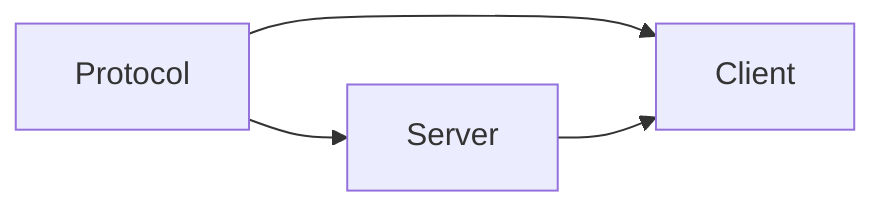
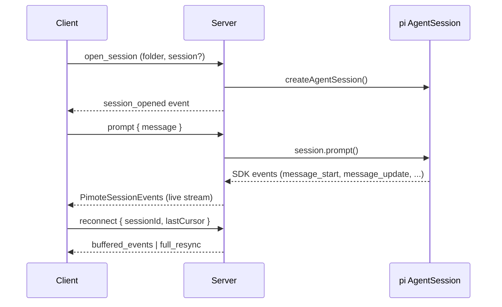
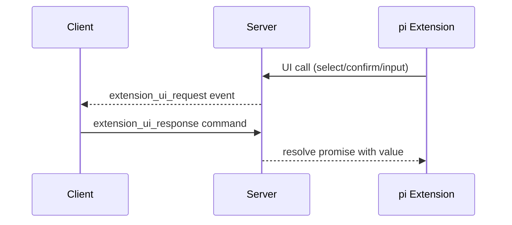

# Codemap

## Overview

Pimote is a PWA + Node.js server for remote access to pi (a coding agent). It uses an npm workspace with three packages: a shared protocol types library, a Node.js HTTP+WebSocket server that manages pi AgentSession instances, and a SvelteKit PWA client with Svelte 5 runes and shadcn-svelte for real-time conversation rendering.

### Key Flows

## Modules

### Protocol

Shared TypeScript types defining the WebSocket wire format between client and server.

**Responsibilities:** command types (client→server), event types (server→client), response envelope, session state shape, message content model

**Dependencies:** none

**Files:**
- `shared/src/**`

### Server

Node.js HTTP + WebSocket server that hosts pi AgentSession instances and bridges them to remote clients.

**Responsibilities:** HTTP static file serving and SPA fallback, WebSocket upgrade and message routing, session lifecycle (open/close/reconnect/idle-reap), pi SDK AgentSession creation and event subscription, event buffering with streaming delta coalescing for reconnect replay, folder/session discovery via filesystem scanning, extension UI bridging (dialog methods → WebSocket round-trips, fire-and-forget → events, TUI-only → no-ops), session takeover (find and kill external pi processes via /proc), configuration loading from ~/.config/pimote/config.json

**Dependencies:** Protocol (wire format types)

**Files:**
- `server/src/**`

### Client

SvelteKit PWA that renders pi conversations in real time and provides session/folder browsing, model/thinking controls, and extension UI dialogs.

**Responsibilities:** WebSocket connection management with auto-reconnect, reactive session state (messages, streaming text, tool calls, model, thinking level), folder and session index browsing, message rendering with markdown + syntax highlighting, streaming text and thinking block display, tool call visualization, model and thinking level pickers, extension UI dialog handling (select, confirm, input, editor) and status display, input bar with prompt/steer/follow-up/abort modes, PWA manifest and service worker, shadcn-svelte UI primitives (button, badge, dialog, dropdown-menu, input, scroll-area, separator)

**Dependencies:** Protocol (wire format types), Server (WebSocket API)

**Files:**
- `client/src/**`
- `client/static/**`
- `client/svelte.config.js`
- `client/vite.config.ts`
- `client/components.json`
