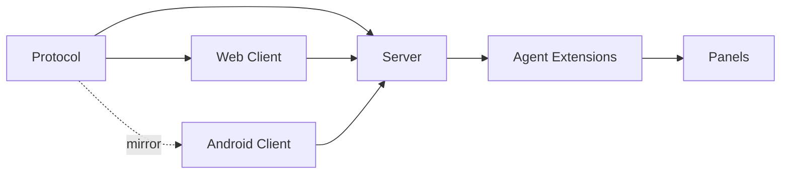
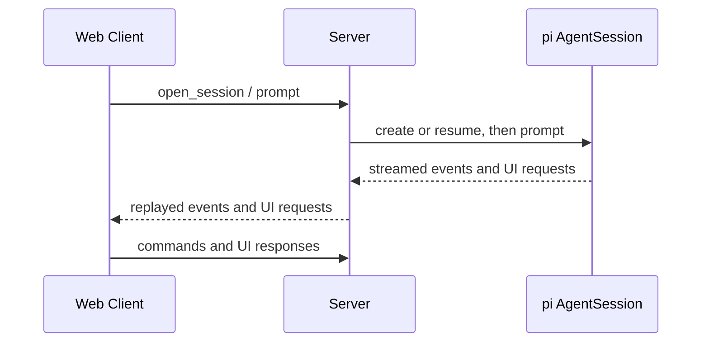

# Codemap

## Overview

Pimote is a Node.js server and SvelteKit PWA for using pi coding-agent sessions remotely. It shares a TypeScript WebSocket protocol with the PWA and an independent Kotlin Android voice client; pi extensions provide voice, static hosting, file downloads, and panel cards.

```mermaid
graph LR
  Protocol --> Server
  Protocol --> Web_Client[Web Client]
  Protocol -.mirror.-> Android_Client[Android Client]
  Web_Client --> Server
  Android_Client --> Server
  Server --> Agent_Extensions[Agent Extensions]
  Agent_Extensions --> Panels
```

### Key Flows

```mermaid
sequenceDiagram
  participant C as Web Client
  participant S as Server
  participant P as pi AgentSession

  C->>S: open_session / prompt
  S->>P: create or resume, then prompt
  P-->>S: streamed events and UI requests
  S-->>C: replayed events and UI requests
  C->>S: commands and UI responses
```

## Modules

### Protocol

Defines the TypeScript WebSocket contract shared by server and web client.

**Responsibilities:** commands, events, request/response envelopes, session and message data, extension UI, panels, downloads, voice, provider login, tree navigation

**Dependencies:** none; Android maintains a hand-written mirror of the subset it consumes

**Files:**

- `shared/src/**`

### Server

Hosts pi `AgentSession` instances and exposes the HTTP and WebSocket API.

**Responsibilities:** CLI and configuration, static/PWA and WebSocket serving, session slots and replay buffers, command routing, project discovery, ownership/conflict handling, extension UI bridge, auth, push notifications, persistent session metadata

**Dependencies:** Protocol for wire types; Agent Extensions for session tools and resources

**Files:**

- `server/src/*.ts`

### Agent Extensions

In-process pi extensions for optional voice calls, static bundles, and one-shot file downloads.

**Responsibilities:** voice interpreter/worker state machine and speechmux bridge, static-host registry/store/HTTP tools, file-offer registry/HTTP tools, EventBus and panel integration

**Dependencies:** Server for lifecycle, routes, and session EventBus; Protocol for client events; Panels for static-host cards; pi SDK extension APIs

**Files:**

- `server/src/voice/**`
- `server/src/static-host/**`
- `server/src/file-download/**`

### Web Client

Installable SvelteKit PWA for browsing, controlling, and rendering remote pi sessions.

**Responsibilities:** WebSocket reconnect and session state, streamed conversation/tool rendering, composer and autocomplete, extension dialogs/panels, session navigation, downloads and push, browser voice calls

**Dependencies:** Protocol for wire types; Server's HTTP/WebSocket API

**Files:**

- `client/src/**`

### Panels

Published `@pimote/panels` library through which pi extensions publish scoped card data.

**Responsibilities:** card types, EventBus detection, namespace-scoped panel handles

**Dependencies:** pi SDK extension APIs

**Files:**

- `packages/panels/src/**`

### Android Client

Native Kotlin voice-first peer that connects to Pimote through Android's calling surfaces.

**Responsibilities:** WebSocket/session synchronization, self-managed Telecom calls and WebRTC audio, contacts and Assistant shortcuts, Android Auto, Compose UI, settings and authentication

**Dependencies:** Server's WebSocket API; Protocol mirror; Android Telecom, Contacts, Car App, and WebRTC APIs

**Files:**

- `mobile/android/**`

### Development Tooling

Packages, boots, tests, and manually exercises the product surfaces.

**Responsibilities:** npm executable and install helpers, patching and service setup, diagnostic scripts, end-to-end smoke suites, extension UI test fixture

**Dependencies:** Server, Web Client, Agent Extensions, and Android Client as applicable

**Files:**

- `bin/**`
- `scripts/**`
- `tools/**`
- `.pi/extensions/**`
