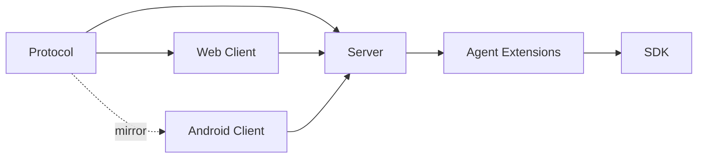
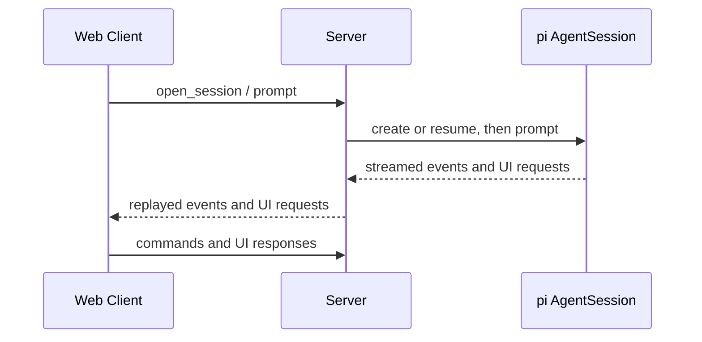

# Codemap

## Overview

Pimote is a Node.js server and SvelteKit PWA for using pi coding-agent sessions remotely. It shares a TypeScript WebSocket protocol with the PWA and an independent Kotlin Android voice client; pi extensions provide voice, static hosting, file downloads, panel cards, and interception for native `!` bash commands.

```mermaid
graph LR
  Protocol --> Server
  Protocol --> Web_Client[Web Client]
  Protocol -.mirror.-> Android_Client[Android Client]
  Web_Client --> Server
  Android_Client --> Server
  Server --> Agent_Extensions[Agent Extensions]
  Agent_Extensions --> SDK
```

### Key Flows

```mermaid
sequenceDiagram
  participant C as Web Client
  participant S as Server
  participant P as pi AgentSession

  C->>S: open_session / prompt
  S->>P: create or resume, then prompt
  P-->>S: streamed events and UI requests
  S-->>C: replayed events and UI requests
  C->>S: commands and UI responses
```

## Modules

### Protocol

Defines the TypeScript WebSocket contract shared by server and web client.

**Responsibilities:** commands (including session-scoped native bash and abort, plus server-level file_get/file_put without a session), events (including live bash output), request/response envelopes, session and message data, native bash result metadata, extension UI, panels, downloads, voice, provider login, tree navigation, update-availability status/events, folder/repo discovery and curation (list_folders, list_repos, update_folder, create_folder, create_hub, disband_hub, folders_changed; FolderInfo rows with nature/persona/shortcutCount/missing/repos?/userTags?), ephemeral manager prompt/abort and streamed manager events

**Dependencies:** none; Android maintains a hand-written mirror of the subset it consumes

**Files:**

- `shared/src/**`

### Server

Hosts pi `AgentSession` instances and exposes the HTTP and WebSocket API.

**Responsibilities:** CLI and configuration (including optional tagSnippets), static/PWA and WebSocket serving, session slots and replay buffers, command routing (including native bash execution, extension interception, cancellation, and generic file_get/file_put dispatch), file-edit service (leading-tilde path expansion, UTF-8 reads, atomic writes preserving symlinks and file mode), SDK event boundary for live bash output, sparse folder discovery (`folder-model/`: marker-aware code/persona classification, no depth bound — descent through skipped folders, stop at included ones, shortcut recursion over top-level out-of-tree symlinks, canonical-path identity, injectable FolderFs seam, shared `classifyFolder` for session-event fallback), repo index as a thin adapter over the folder model (stable `list(): Promise<RepoInfo[]>`, stale-while-revalidate TTL caches with change-notifying background refresh, per-repo git status, registered source merge and open hooks), session records (`session-records.ts`: on-disk session listing/open/resume/delete/rename over the pi session dirs — no discovery), per-file session summary cache behind session listings (mtime+size keyed; serves list metadata without re-parsing session history), curated folder registry (`folder-registry.ts`: favorite/archive/tags overrides keyed by canonical path, hub create/disband with symlinked members + `git init` + `.gitignore` + generated AGENTS.md, `registry.json` persistence with legacy `multiRepo` read compat, folders_changed broadcasts), user folder sources (`folder-sources/`: jiti-loaded TS modules from `folderSourcesDir`, `@pimote/sdk/folders` types, legacy `project-sources` dir / `projectSourcesDir` key read compat), ephemeral per-connection manager agent (lifecycle with idle reaper, pimote folder/session-management tools incl. pimote_list_folders and pimote_folder_tree, in-memory session factory, static hosting/download artifact snapshots retained for 24 hours after disposal and cleared on restart), ownership/conflict handling, extension UI bridge (including panel steady-state repaint requests via the `pimote:panels:sync` EventBus channel, emitted on client claim and session reset so extensions re-project panel cards onto the in-memory panel snapshot), auth, push notifications (metadata `projectName` is deliberately retained wire vocabulary), persistent session metadata, version lookup and TTL-cached npm update checks with per-connection update events

**Dependencies:** Protocol for wire types; Agent Extensions for session tools and resources; `@pimote/sdk` (types-only) for the folder-sources seam

**Files:**

- `server/src/*.ts` (including `server/src/folder-model/**`, `server/src/session-records.ts`, `server/src/folder-registry.ts`, `server/src/repo-index.ts`)
- `server/src/manager/**`
- `server/src/folder-sources/**`

### Agent Extensions

In-process pi extensions for optional voice calls, static bundles, and one-shot file downloads.

**Responsibilities:** voice interpreter/worker state machine and speechmux bridge, static-host registry/store/HTTP tools, file-offer registry/HTTP tools, EventBus and panel integration

**Dependencies:** Server for lifecycle, routes, and session EventBus; Protocol for client events; SDK panels for static-host cards; pi SDK extension APIs

**Files:**

- `server/src/voice/**`
- `server/src/static-host/**`
- `server/src/file-download/**`

### Web Client

Installable SvelteKit PWA for browsing, controlling, and rendering remote pi sessions.

**Responsibilities:** WebSocket reconnect and session state, streamed conversation/tool rendering, transient bash execution reduction and correlation, composer bang-command parsing/dispatch, dedicated bash output/status/cancellation rendering, extension dialogs/panels, session navigation, dashboard landing (folders column + manager chat side-by-side on desktop, fullscreen list + manager sheet on mobile), folder list (`FolderList`) with four nature × shortcutCount row icons (code, code-hub, persona, persona-hub), persona display names/subtitles, favorites/archive/repo chips, hub create/disband dialogs and the home-page Agent instructions entry, folders_changed sync, config-file editor dialog and file-editor state store (AGENTS.md load/save, discard confirmation, tag snippets), pure tag-wrap semantics and CodeMirror EditorView seam, manager chat (ephemeral per connection, manager events reduced onto a synthetic session slot, report cards opening in new tabs and explicit file-download links), downloads and push, browser voice calls, version-keyed update persistence and banner/ambient update surfaces

**Dependencies:** Protocol for wire types; Server's HTTP/WebSocket API

**Files:**

- `client/src/**` (including `client/src/lib/components/Dashboard.svelte`, `client/src/lib/components/FolderList.svelte`, `client/src/lib/components/ManagerChat.svelte`, `client/src/lib/stores/folder-store.svelte.ts`, `client/src/lib/stores/manager-store.svelte.ts`, `client/src/lib/stores/connection.svelte.ts`, `client/src/lib/stores/session-registry.svelte.ts`, `client/src/lib/session-route.ts` (session-URL load-then-show decision), `client/src/lib/bash-command.ts`, and `client/src/lib/components/BashExecution.svelte`)

### SDK

Published `@pimote/sdk` extensibility package that pi extensions import to talk to pimote.

**Responsibilities:** card types, EventBus detection, namespace-scoped panel handles, folder discovery/creation seam types

**Dependencies:** pi SDK extension APIs

**Files:**

- `packages/sdk/src/**`

### Android Client

Native Kotlin voice-first peer that connects to Pimote through Android's calling surfaces.

**Responsibilities:** WebSocket/session synchronization, self-managed Telecom calls and WebRTC audio, contacts and Assistant shortcuts, Android Auto, Compose UI, settings and authentication

**Dependencies:** Server's WebSocket API; Protocol mirror (aligned on FolderInfo/list_folders — the TS side's project names were the stale half of the drift and are renamed; residual accepted debt: push metadata `projectName` is deliberately retained wire vocabulary, and Android's own field-name compression — e.g. its `ProjectListScreen` — is its own business); Android Telecom, Contacts, Car App, and WebRTC APIs

**Files:**

- `mobile/android/**`

### Development Tooling

Packages, boots, tests, and manually exercises the product surfaces.

**Responsibilities:** npm executable and install helpers, patching and service setup, diagnostic scripts, end-to-end smoke suites, deterministic update-notification server/PWA smoke harness, dashboard/folders/hubs/manager smoke (real server in an isolated HOME against a fabricated multi-root tree with personas, shortcuts, and folder-source fixtures, driven via agent-browser plus a second WebSocket probe client; includes unscanned-cwd session fallback and legacy `multiRepo` registry compatibility probes), deterministic manager-toolset probe (registration and execution of `pimote_list_folders`/`pimote_folder_tree` against real folder-model and registry ports, no server/browser/LLM), permanent manual-test plan and driver catalog (PLAN.md, README.md, sandboxed smoke drivers including the AGENTS.md editor journey), shared pi session-dir fixture helper, extension UI test fixture

**Dependencies:** Server, Web Client, Agent Extensions, and Android Client as applicable

**Files:**

- `bin/**`
- `scripts/**`
- `tools/**`
- `tools/manual-test/update-notification-smoke/**`
- `tools/manual-test/project-management-smoke/**`
- `tools/manual-test/manager-tools-smoke/**`
- `tools/manual-test/agents-md-editor-smoke/**`
- `tools/manual-test/PLAN.md`
- `tools/manual-test/README.md`
- `tools/manual-test/lib/**`
- `.pi/extensions/**`
