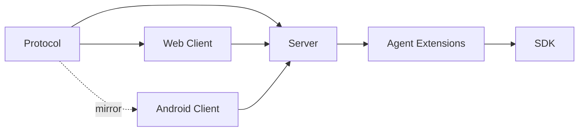
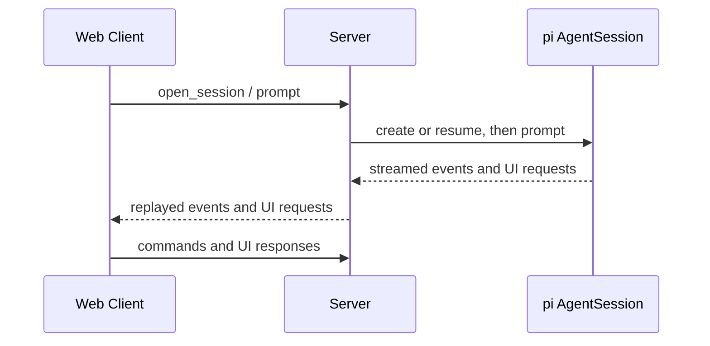

# Codemap

## Overview

Pimote is a Node.js server and SvelteKit PWA for using pi coding-agent sessions remotely. Server and web client share a TypeScript WebSocket protocol; an independent Kotlin Android client mirrors the subset it consumes. Pi extensions provide voice calls, static hosting, file downloads, and panel cards.

```mermaid
graph LR
  Protocol --> Server
  Protocol --> Web_Client[Web Client]
  Protocol -.mirror.-> Android_Client[Android Client]
  Web_Client --> Server
  Android_Client --> Server
  Server --> Agent_Extensions[Agent Extensions]
  Agent_Extensions --> SDK
```

### Key Flows

```mermaid
sequenceDiagram
  participant C as Web Client
  participant S as Server
  participant P as pi AgentSession

  C->>S: open_session / prompt
  S->>P: create or resume, then prompt
  P-->>S: streamed events and UI requests
  S-->>C: replayed events and UI requests
  C->>S: commands and UI responses
```

## Modules

### Protocol

Defines the TypeScript WebSocket contract shared by server and web client.

**Responsibilities:** wire commands and events, request/response envelopes, session and message data, native bash metadata, extension-UI and panel and download types, voice call vocabulary, provider login steps, tree navigation, update availability, folder discovery and curation vocabulary (windowed listings, order tokens, epochs, delta syncs, FolderInfo rows)

**Dependencies:** none; Android maintains a hand-written mirror of the subset it consumes

**Files:**

- `shared/src/**`

### Server

Hosts pi `AgentSession` instances and exposes the HTTP and WebSocket API.

**Responsibilities:** CLI and configuration (roots, managerRoot, tagSnippets, VAPID), HTTP and PWA serving, WebSocket command routing and envelopes, AgentSession slots with replay buffers, SDK-to-wire event mapping, file edit and file get/put service (tilde expansion, atomic symlink-preserving writes), `fd`-backed file-reference autocomplete, session records, summaries, metadata, and lifetime cost, sparse folder-model discovery (marker-aware code/persona classification, visit budget with partial-tree fallback), repo index over the folder model (TTL caches, stale-while-revalidate, bounded git-status probes), folder listing (windows, monotonic epochs, reconciled deltas, two-tier search), curated folder registry (favorites, tags, hubs with symlinked members and generated AGENTS.md), jiti-loaded user folder sources, manager extension lifecycle and its nine folder/persona/session tools, session ownership and takeover checks, provider OAuth login orchestration, web push, TTL-cached npm update checks, shared utilities (paths, branding, version, tool-result idiom, `sdk-twins` Protocol/SDK parity assertions)

Client auth is external (Cloudflare Access); the server implements no auth.

**Dependencies:** Protocol for wire types; Agent Extensions for session tools and resources; `@pimote/sdk` (types-only) for the folder-sources seam

**Files:**

- `server/src/*.ts`
- `server/src/folder-model/**`
- `server/src/manager/**`
- `server/src/folder-sources/**`

### Agent Extensions

In-process pi extensions for voice calls, static bundles, and one-shot file downloads.

**Responsibilities:** voice call state machine (pure reducer with lifecycle/streaming/walkback sub-machines plus imperative shell), speechmux WebSocket bridge and call-bind dispatch, FIFO utterance queue with settlement-aware interruption, identity-based walk-back context rewrite, interpreter prompt riding a named pi prompt section, static-host registry, store, HTTP handler, tools, and runtime-materialized `static-report` skill, file-download offer registry and HTTP tools, panel and EventBus integration

`voice-orchestrator.ts`/`voice-orchestrator-boot.ts` and `session-json-store.ts` sit under the Server glob but serve this module.

**Dependencies:** Server for lifecycle, routes, and session EventBus; Protocol for client events; SDK panels for static-host cards; pi SDK extension APIs

**Files:**

- `server/src/voice/**`
- `server/src/voice-orchestrator.ts`
- `server/src/voice-orchestrator-boot.ts`
- `server/src/static-host/**`
- `server/src/file-download/**`
- `server/src/session-json-store.ts` (shared persistence seam)

### Web Client

Installable SvelteKit PWA for browsing, controlling, and rendering remote pi sessions.

**Responsibilities:** WebSocket reconnect and request/response, session registry with URL-synced navigation and definitive open rejection cleanup, streamed conversation and tool rendering, composer bang-command parsing with dedicated bash execution UI, explicit abort with draft restore, manager input as a toolbar box (search/manager toggle, prior-manager-session dropdown) submitting over ordinary persisted sessions, single-column dashboard landing with desktop Continue cards, windowed virtualized folder list (TanStack variable-height rows, epoch-guarded delta sync, server-authoritative debounced search, live subset re-sort), hub create/disband, favorites and archive, config-file editor (AGENTS.md load/save, tag snippets, CodeMirror seam), composer `@`-file autocomplete, extension dialogs and panels, downloads inbox and push, browser voice calls with TTS, provider login, update banner and ambient status, PWA service worker

**Dependencies:** Protocol for wire types; Server's HTTP/WebSocket API

**Files:**

- `client/src/**` (notably `lib/components/Dashboard.svelte`, `lib/components/FolderList.svelte`, `lib/components/HomeToolbar.svelte`, `lib/components/BashExecution.svelte`, `lib/stores/folder-store.svelte.ts`, `lib/stores/connection.svelte.ts`, `lib/stores/session-registry.svelte.ts`, `lib/session-route.ts`, `lib/bash-command.ts`, `lib/manager-composer.ts`)

### SDK

Published `@pimote/sdk` extensibility package that pi extensions import to talk to pimote.

**Responsibilities:** card types, EventBus panel detection, namespace-scoped panel handles, folder discovery and creation seam types (`@pimote/sdk/folders`, awaited `onFolderOpen`), RepoInfo twin of the wire type

The server's `sdk-twins.ts` asserts compile-time equality between SDK and Protocol types.

**Dependencies:** pi SDK extension APIs

**Files:**

- `packages/sdk/src/**`

### Android Client

Native Kotlin voice-first peer that connects to Pimote through Android's calling surfaces.

**Responsibilities:** WebSocket/session synchronization, self-managed Telecom calls, WebRTC audio, contacts sync, Assistant shortcuts, Android Auto car UI, Compose UI, settings and authentication

**Dependencies:** Server's WebSocket API; Protocol mirror (accepted debt: windowed `list_folders` and `folders_changed` hard-cut the old Android contract with no compatibility shim; Android stays broken until its own update; push metadata `projectName` is deliberate wire vocabulary); Android Telecom, Contacts, Car App, and WebRTC APIs

**Files:**

- `mobile/android/**`

### Development Tooling

Packages, boots, tests, and manually exercises the product surfaces.

**Responsibilities:** npm CLI entry, install/service/patch setup scripts, session archival and voice diagnostics, manual-test plan and driver catalog, end-to-end dashboard/folders/hubs smoke against a fabricated multi-root tree, manager-tool and manager-lifecycle probes, windowed folder-paging smoke over a ~250-row fixture, journey smokes (AGENTS.md editor, `@`-file syntax, cost accumulation, streaming code highlight, static host/PWA, downloads, provider login), deterministic update-notification harness, shared smoke harness lib (report, sandbox, ws-probe, browser driver, session-dir fixtures), extension UI test fixture, release/publish CI and Docker-based Android build targets

**Dependencies:** Server, Web Client, Agent Extensions, and Android Client as applicable

**Files:**

- `bin/**`
- `scripts/**`
- `tools/**`
- `.pi/**`
- `Makefile`
- `patches/**`
- `.github/workflows/**`
- `.husky/**`
- `package.json`
