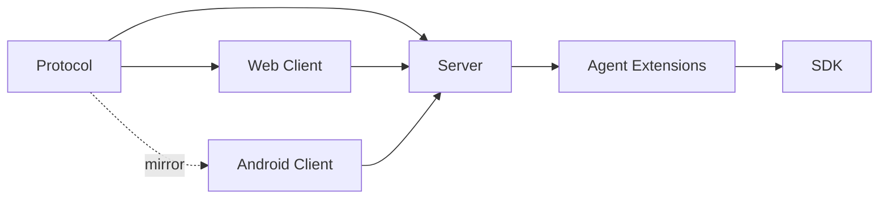
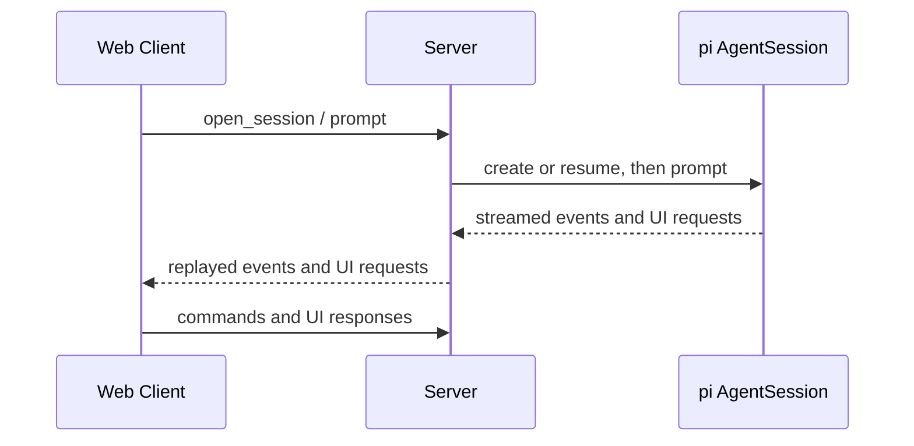

# Codemap

## Overview

Pimote is a Node.js server and SvelteKit PWA for using pi coding-agent sessions remotely. It shares a TypeScript WebSocket protocol with the PWA and an independent Kotlin Android voice client; pi extensions provide voice, static hosting, file downloads, panel cards, and interception for native `!` bash commands.

```mermaid
graph LR
  Protocol --> Server
  Protocol --> Web_Client[Web Client]
  Protocol -.mirror.-> Android_Client[Android Client]
  Web_Client --> Server
  Android_Client --> Server
  Server --> Agent_Extensions[Agent Extensions]
  Agent_Extensions --> SDK
```

### Key Flows

```mermaid
sequenceDiagram
  participant C as Web Client
  participant S as Server
  participant P as pi AgentSession

  C->>S: open_session / prompt
  S->>P: create or resume, then prompt
  P-->>S: streamed events and UI requests
  S-->>C: replayed events and UI requests
  C->>S: commands and UI responses
```

## Modules

### Protocol

Defines the TypeScript WebSocket contract shared by server and web client.

**Responsibilities:** commands (including session-scoped native bash and abort), events (including live bash output), request/response envelopes, session and message data, native bash result metadata, extension UI, panels, downloads, voice, provider login, tree navigation, update-availability status/events, project/repo discovery and curation (list_projects, list_repos, update_project, create_multi_repo_project, disband_project, projects_changed), ephemeral manager prompt/abort and streamed manager events

**Dependencies:** none; Android maintains a hand-written mirror of the subset it consumes

**Files:**

- `shared/src/**`

### Server

Hosts pi `AgentSession` instances and exposes the HTTP and WebSocket API.

**Responsibilities:** CLI and configuration, static/PWA and WebSocket serving, session slots and replay buffers, command routing (including native bash execution, extension interception, and cancellation), SDK event boundary for live bash output, project/repo discovery (bounded recursive repo index over roots and registered sources, stale-while-revalidate TTL caches with change-notifying background refresh, and per-repo git status), per-file session summary cache behind session listings (mtime+size keyed; serves list metadata without re-parsing session history), curated project registry (favorite/archive overrides, multi-repo project create/disband with symlinked members and generated AGENTS.md, JSON persistence, projects_changed broadcasts), user project sources (jiti-loaded TS modules from a configured dir), ephemeral per-connection manager agent (lifecycle with idle reaper, pimote listing-tool extension, in-memory session factory), ownership/conflict handling, extension UI bridge, auth, push notifications, persistent session metadata, version lookup and TTL-cached npm update checks with per-connection update events

**Dependencies:** Protocol for wire types; Agent Extensions for session tools and resources; `@pimote/sdk` (types-only) for the project-sources seam

**Files:**

- `server/src/*.ts`
- `server/src/manager/**`
- `server/src/project-sources/**`

### Agent Extensions

In-process pi extensions for optional voice calls, static bundles, and one-shot file downloads.

**Responsibilities:** voice interpreter/worker state machine and speechmux bridge, static-host registry/store/HTTP tools, file-offer registry/HTTP tools, EventBus and panel integration

**Dependencies:** Server for lifecycle, routes, and session EventBus; Protocol for client events; SDK panels for static-host cards; pi SDK extension APIs

**Files:**

- `server/src/voice/**`
- `server/src/static-host/**`
- `server/src/file-download/**`

### Web Client

Installable SvelteKit PWA for browsing, controlling, and rendering remote pi sessions.

**Responsibilities:** WebSocket reconnect and session state, streamed conversation/tool rendering, transient bash execution reduction and correlation, composer bang-command parsing/dispatch, dedicated bash output/status/cancellation rendering, extension dialogs/panels, session navigation, dashboard landing (projects column + manager chat side-by-side on desktop, fullscreen list + manager sheet on mobile), project list with favorites/archive/repo chips and hub create/disband dialogs, projects_changed sync, manager chat (ephemeral per connection, manager events reduced onto a synthetic session slot), downloads and push, browser voice calls, version-keyed update persistence and banner/ambient update surfaces

**Dependencies:** Protocol for wire types; Server's HTTP/WebSocket API

**Files:**

- `client/src/**` (including `client/src/lib/components/Dashboard.svelte`, `client/src/lib/components/ProjectList.svelte`, `client/src/lib/components/ManagerChat.svelte`, `client/src/lib/stores/project-store.svelte.ts`, `client/src/lib/stores/manager-store.svelte.ts`, `client/src/lib/stores/connection.svelte.ts`, `client/src/lib/stores/session-registry.svelte.ts`, `client/src/lib/bash-command.ts`, and `client/src/lib/components/BashExecution.svelte`)

### SDK

Published `@pimote/sdk` extensibility package that pi extensions import to talk to pimote.

**Responsibilities:** card types, EventBus detection, namespace-scoped panel handles, project discovery/creation seam types

**Dependencies:** pi SDK extension APIs

**Files:**

- `packages/sdk/src/**`

### Android Client

Native Kotlin voice-first peer that connects to Pimote through Android's calling surfaces.

**Responsibilities:** WebSocket/session synchronization, self-managed Telecom calls and WebRTC audio, contacts and Assistant shortcuts, Android Auto, Compose UI, settings and authentication

**Dependencies:** Server's WebSocket API; Protocol mirror (currently stale on the project-management renames — FolderInfo→ProjectInfo, list_folders→list_projects — accepted debt); Android Telecom, Contacts, Car App, and WebRTC APIs

**Files:**

- `mobile/android/**`

### Development Tooling

Packages, boots, tests, and manually exercises the product surfaces.

**Responsibilities:** npm executable and install helpers, patching and service setup, diagnostic scripts, end-to-end smoke suites, deterministic update-notification server/PWA smoke harness, dashboard/projects/hubs/manager smoke (real server in an isolated HOME against a fabricated multi-root tree, driven via agent-browser plus a second WebSocket probe client), shared pi session-dir fixture helper, extension UI test fixture

**Dependencies:** Server, Web Client, Agent Extensions, and Android Client as applicable

**Files:**

- `bin/**`
- `scripts/**`
- `tools/**`
- `tools/manual-test/update-notification-smoke/**`
- `tools/manual-test/project-management-smoke/**`
- `tools/manual-test/lib/**`
- `.pi/extensions/**`
