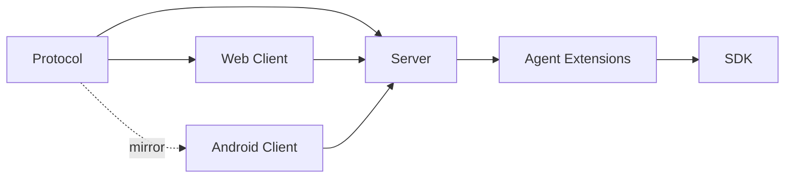
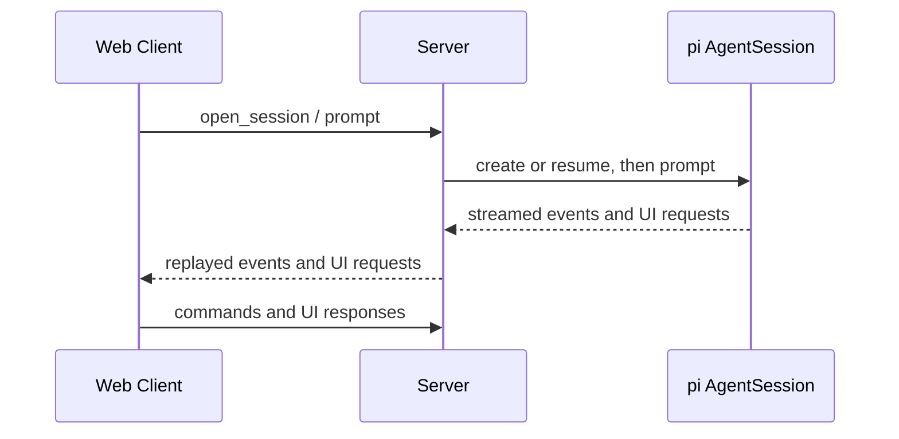

# Codemap

## Overview

Pimote is a Node.js server and SvelteKit PWA for using pi coding-agent sessions remotely. It shares a TypeScript WebSocket protocol with the PWA and an independent Kotlin Android voice client; pi extensions provide voice, static hosting, file downloads, panel cards, and interception for native `!` bash commands.

```mermaid
graph LR
  Protocol --> Server
  Protocol --> Web_Client[Web Client]
  Protocol -.mirror.-> Android_Client[Android Client]
  Web_Client --> Server
  Android_Client --> Server
  Server --> Agent_Extensions[Agent Extensions]
  Agent_Extensions --> SDK
```

### Key Flows

```mermaid
sequenceDiagram
  participant C as Web Client
  participant S as Server
  participant P as pi AgentSession

  C->>S: open_session / prompt
  S->>P: create or resume, then prompt
  P-->>S: streamed events and UI requests
  S-->>C: replayed events and UI requests
  C->>S: commands and UI responses
```

## Modules

### Protocol

Defines the TypeScript WebSocket contract shared by server and web client.

**Responsibilities:** commands (including session-scoped native bash and abort, plus server-level file_get/file_put without a session), events (including live bash output), request/response envelopes, session and message data (message/tool-call `durationMs`, settle `aborted`), native bash result metadata, extension UI, panels, downloads, voice, provider login, tree navigation, update-availability status/events, folder/repo discovery and curation (list_folders, list_repos, update_folder, create_folder, create_hub, disband_hub, folders_changed; windowed list_folders with owned order tokens, repin, archive/query filters, totals and wire epochs; folders_changed deltas with changed/removedPaths; FolderInfo rows with nature/persona/shortcutCount/missing/repo?/repos?/userTags?/matchedSessionIds?; ListFoldersResponseData includes managerRoot)

**Dependencies:** none; Android maintains a hand-written mirror of the subset it consumes

**Files:**

- `shared/src/**`

### Server

Hosts pi `AgentSession` instances and exposes the HTTP and WebSocket API.

**Responsibilities:** CLI and configuration (including optional tagSnippets), static/PWA and WebSocket serving, session slots and replay buffers, command routing (including native bash execution, extension interception, cancellation with queued-input capture before explicit abort and response-based draft recovery, and generic file_get/file_put dispatch), file-edit service (leading-tilde path expansion, UTF-8 reads, atomic writes preserving symlinks and file mode), SDK event boundary for live bash output, sparse folder discovery (`folder-model/`: marker-aware code/persona classification, no depth bound — descent through skipped folders, stop at included ones, shortcut recursion over top-level out-of-tree symlinks, canonical-path identity, injectable FolderFs seam, shared `classifyFolder` for session-event fallback), repo index as a thin adapter over the folder model (stable `list(): Promise<RepoInfo[]>` and cached `tree(): Promise<SparseTree>` sharing one discovery walk, stale-while-revalidate TTL caches with change-notifying background refresh, per-repo git status probed on `list()` but identity-first on `listLazy`/`enrichStatus`, which probe git status only for served paths under bounded concurrency via `concurrency.ts` `mapWithConcurrency`; `invalidateListing()` re-walks discovery and keeps warm git probes, full `invalidate()` also drops them; registered source merge and open hooks), session records (`session-records.ts`: on-disk session listing/open/resume/delete/rename over the pi session dirs — no discovery), per-file session summary cache behind session listings (mtime+size keyed; batched `listMany` reuses parses), folder listing (`folder-listing.ts`: server-wide stale-while-revalidate session metadata, connection-owned path-only pins, favorite/recency/name/path order, two-tier search, filtered offset windows served with window/delta-scoped git enrichment and the `lastActivity` ordering fact on rows, monotonic epochs, reconciled deltas; registry failures propagate, metadata failures retain last good snapshot), curated folder registry (`folder-registry.ts`: favorite/archive/tags overrides keyed by canonical path, hub create/disband with symlinked members + `git init` + `.gitignore` + generated AGENTS.md, `registry.json` persistence with legacy `multiRepo` read compat, exact mutation/dependent-hub targets and own cached `repo` facts on plain code rows, lazy `listLazy`/`enrichRows` patching served rows in place, complete-list manager seam), user folder sources (`folder-sources/`: jiti-loaded TS modules from `folderSourcesDir`, `@pimote/sdk/folders` types, legacy `project-sources` dir / `projectSourcesDir` key read compat), manager persona lifecycle (managerRoot config default under `~/.local/state/pimote/manager`, home-placement guard, non-overwriting AGENTS.md/memory.md seeding, persisted manager-root sessions, canonical-cwd extension attachment, pimote_create_persona and pimote_list_personas alongside the existing manager tools; manager-root listing/tree exclusion through RepoIndex `excludeEntryPaths`), ownership/conflict handling, extension UI bridge (including panel steady-state repaint requests via the `pimote:panels:sync` EventBus channel, emitted on client claim and session reset so extensions re-project panel cards onto the in-memory panel snapshot), auth, push notifications (metadata `projectName` is deliberately retained wire vocabulary), persistent session metadata, version lookup and TTL-cached npm update checks with per-connection update events

**Dependencies:** Protocol for wire types; Agent Extensions for session tools and resources; `@pimote/sdk` (types-only) for the folder-sources seam

**Files:**

- `server/src/*.ts` (including `server/src/folder-model/**`, `server/src/session-records.ts`, `server/src/session-summaries.ts`, `server/src/folder-listing.ts`, `server/src/folder-registry.ts`, `server/src/repo-index.ts`, `server/src/concurrency.ts`)
- `server/src/manager/**`
- `server/src/folder-sources/**`

### Agent Extensions

In-process pi extensions for optional voice calls, static bundles, and one-shot file downloads.

**Responsibilities:** voice interpreter/worker state machine and speechmux bridge, voice-owned FIFO utterance submission through the session interface with settlement-aware interruption and pending cancellation on call teardown or explicit Abort, static-host registry/store/HTTP tools, file-offer registry/HTTP tools, EventBus and panel integration

**Dependencies:** Server for lifecycle, routes, and session EventBus; Protocol for client events; SDK panels for static-host cards; pi SDK extension APIs

**Files:**

- `server/src/voice/**`
- `server/src/static-host/**`
- `server/src/file-download/**`

### Web Client

Installable SvelteKit PWA for browsing, controlling, and rendering remote pi sessions.

**Responsibilities:** WebSocket reconnect and session state, streamed conversation/tool rendering, shared explicit-abort handling that restores returned queued messages into session composer drafts, transient bash execution reduction and correlation, composer bang-command parsing/dispatch, dedicated bash output/status/cancellation rendering, extension dialogs/panels, session navigation, dashboard landing (folders column + manager area side-by-side on desktop, fullscreen list + manager sheet on mobile), manager composer decision and submit flow (`managerComposerAction`/`submitManagerMessage`) over ordinary persisted sessions, folder list (`FolderList`) with four nature × shortcutCount row icons (code, code-hub, persona, persona-hub), persona display names/subtitles, favorites/archive/repo chips from row-owned `repo` and hub `repos` facts, TanStack variable-height virtualization over the dashboard scroll element, rendered-row-only session lists, hub create/disband dialogs and the home-page Agent instructions entry, path-keyed accumulating FolderStore with adopted window tokens, server-authoritative debounced search, epoch-guarded delta sync, fetched-frontier window continuation (`shouldFetchNextWindow` off the store frontier), and live subset re-sort folding row `lastActivity` and live-session counts without waiting for session lists; open/bound chat sessions restore independently of folder windows, config-file editor dialog and file-editor state store (AGENTS.md load/save, discard confirmation, tag snippets), pure tag-wrap semantics and CodeMirror EditorView seam, manager dashboard composer and persisted manager-session list over the ordinary conversation/session flow, downloads and push, browser voice calls, version-keyed update persistence and banner/ambient update surfaces

**Dependencies:** Protocol for wire types; Server's HTTP/WebSocket API

**Files:**

- `client/src/**` (including `client/src/lib/components/Dashboard.svelte`, `client/src/lib/components/FolderList.svelte`, `client/src/lib/components/ManagerChat.svelte`, `client/src/lib/stores/folder-store.svelte.ts`, `client/src/lib/stores/manager-store.svelte.ts`, `client/src/lib/stores/connection.svelte.ts`, `client/src/lib/stores/session-registry.svelte.ts`, `client/src/lib/session-route.ts` (session-URL load-then-show decision), `client/src/lib/bash-command.ts`, and `client/src/lib/components/BashExecution.svelte`)

### SDK

Published `@pimote/sdk` extensibility package that pi extensions import to talk to pimote.

**Responsibilities:** card types, EventBus detection, namespace-scoped panel handles, folder discovery/creation seam types

**Dependencies:** pi SDK extension APIs

**Files:**

- `packages/sdk/src/**`

### Android Client

Native Kotlin voice-first peer that connects to Pimote through Android's calling surfaces.

**Responsibilities:** WebSocket/session synchronization, self-managed Telecom calls and WebRTC audio, contacts and Assistant shortcuts, Android Auto, Compose UI, settings and authentication

**Dependencies:** Server's WebSocket API; Protocol mirror (accepted debt: windowed list_folders and changed/removedPaths folders_changed hard-cut the old Android contract; Android remains broken until its separate update, with no compatibility shim; push metadata `projectName` remains deliberate wire vocabulary); Android Telecom, Contacts, Car App, and WebRTC APIs

**Files:**

- `mobile/android/**`

### Development Tooling

Packages, boots, tests, and manually exercises the product surfaces.

**Responsibilities:** npm executable and install helpers, patching and service setup, diagnostic scripts, end-to-end smoke suites, deterministic update-notification server/PWA smoke harness, dashboard/folders/hubs/manager smoke (real server in an isolated HOME against a fabricated multi-root tree with personas, shortcuts, and folder-source fixtures, driven via agent-browser plus a second WebSocket probe client; adopts tokens while accumulating windows, explicitly repins fresh discovery orders, checks archive filters and delta sync, scrolls virtualized rows; includes unscanned-cwd session fallback and legacy `multiRepo` registry compatibility probes), deterministic manager-toolset probe (registration and execution of `pimote_list_folders`/`pimote_folder_tree` and persona tools against real folder-model and registry ports, no server/browser/LLM), manager lifecycle smoke (manager-root seeding, placement guard, listing exclusion, persisted-session restart/reconnect behavior), windowed folder-listing smoke (`folder-paging-smoke`: WS paging/search/delta probe plus agent-browser driver over a ~250-row fixture with page-side instrumentation counting list_folders/list_sessions/repin/includeArchived and forcing reconnects, `FP_FOLDERS`/`FP_SHOTS`/`FP_KEEP` params), permanent manual-test plan and driver catalog (PLAN.md, README.md, sandboxed smoke drivers including the AGENTS.md editor journey and journey 12's folder-paging scale checks), shared manual-test harness helpers (`tools/manual-test/lib/`: report, sandbox, ws-probe with limit/windowPaths/windowCount continuity checks, browser driver with navigation-retry and markSent/sentSince/pageConsole diagnostics, pi session-dir fixture helper), extension UI test fixture

**Dependencies:** Server, Web Client, Agent Extensions, and Android Client as applicable

**Files:**

- `bin/**`
- `scripts/**`
- `tools/**`
- `tools/manual-test/**`
- `tools/manual-test/project-management-smoke/**`
- `tools/manual-test/manager-tools-smoke/**`
- `tools/manual-test/folder-paging-smoke/**`
- `tools/manual-test/agents-md-editor-smoke/**`
- `tools/manual-test/PLAN.md`
- `tools/manual-test/README.md`
- `tools/manual-test/lib/**`
- `.pi/extensions/**`
